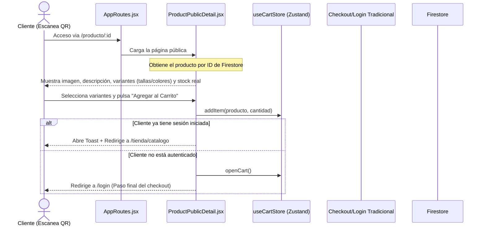

# Manual de Desarrollo: Módulo de Compra de Productos por Código QR (v2.0)

## 1. Propósito y Visión General
El **Módulo de Compra de Productos por Código QR** resuelve el problema de fricción de compra en establecimientos físicos. Permite a los clientes escanear un código QR impreso en un menú físico, publicidad o mesa, y ser dirigidos inmediatamente al detalle de compra de ese producto.

En su versión 2.0, el flujo ha sido rediseñado para migrar de una lógica de registro express en catálogo (con alta fricción y lag) a una **Vista Pública Dinámica Premium** (`/producto/:id`).

Esta nueva vista es pública, carga instantáneamente mediante caché y React Query, y ofrece una experiencia libre de autenticaciones previas para no interrumpir el embudo de conversión del cliente.

---

## 2. Arquitectura de Seguridad y Flujo de Datos (v2.0)

El flujo inicia con el escaneo de un QR físico que apunta directamente a la ruta pública `/producto/:id`.



---

## 3. Guía de Integración Técnica

### Paso 1: Configuración del Flag del Módulo
El administrador controla el encendido/apagado del módulo desde la base de datos centralizada en la colección `appConfig`.
- Propiedad Firestore: `qrEnabled: boolean`

### Paso 2: Generación e Impresión del QR (Admin)
En el panel de inventario (`AdminInventory.jsx`), cuando `qrEnabled === true`, se habilita la acción para descargar un código QR enlazado a la URL del producto.
El enlace generado tiene el siguiente patrón:
```javascript
const qrUrl = `${window.location.origin}/producto/${product.id}`
```
Se utiliza la API externa de `api.qrserver.com` para generar la imagen vectorial de manera limpia y sin inyectar peso al bundle final de la app.

### Paso 3: Registro y Rutas (AppRoutes.jsx)
La ruta se registra como una ruta pública dinámica antes de los guards de autenticación de clientes:
```javascript
const ProductPublicDetail = lazy(() => import('../pages/client/ProductPublicDetail'))

// Dentro de Routes
<Route path="/producto/:id" element={<ProductPublicDetail />} />
```

---

## 4. Preguntas Frecuentes y Solución de Problemas (Troubleshooting)

#### ❓ ¿Qué ocurre si un cliente escanea un código QR heredado (antiguo) que apunta a `/catalogo?qrProduct=...`?
Para mantener compatibilidad con QRs físicos ya impresos y distribuidos, el enrutador implementa un componente puente de redirección:
```javascript
function LegacyCatalogRedirect() {
  const location = useLocation()
  return <Navigate to={`/tienda/catalogo${location.search}`} replace />
}
```
Esto asegura que la app no colapse y el usuario continúe su compra sin problemas.

#### ❓ ¿Es seguro mostrar el producto sin autenticación?
Sí. El producto es información pública (catálogo comercial). Los datos de Firestore para productos están abiertos para lectura pública según la política configurada en `firestore.rules`, lo que permite un renderizado inmediato sin obligar al usuario a iniciar sesión de forma prematura.
