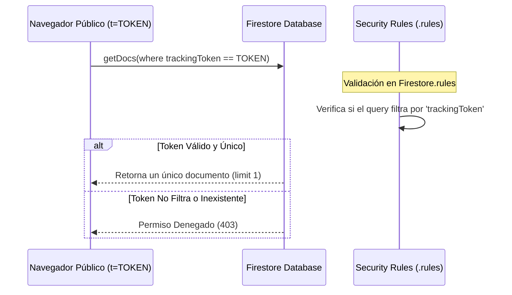

# Manual de Desarrollo: Portal de Seguimiento Público de Pedidos

## 1. Propósito y Visión General
El **Portal de Seguimiento Público** (`OrderTracking.jsx`) resuelve un problema de UX crítico en el comercio conversional y Ecosistema: **cómo permitir que un cliente final consulte el progreso de su despacho en tiempo real sin obligarlo a pasar por una pantalla de login tradicional**.

Esto se logra mediante un **Token de Seguimiento Cifrado de Un Solo Pedido** generado al momento del checkout.

---

## 2. Arquitectura de Seguridad y Flujo de Datos

Para evitar que cualquier persona con un navegador web pueda husmear la base de datos o pedidos ajenos, la consulta pública opera bajo las siguientes medidas de seguridad estrictas:



### Seguridad por Reglas Firestore (.rules)
Las reglas de seguridad para la colección `orders` limitan la lectura pública exclusivamente si el cliente proporciona el token en la consulta:

```javascript
match /orders/{orderId} {
  // Lectura pública permitida SOLO si se filtra exactamente por el trackingToken
  allow read: if resource.data.trackingToken == request.query.where.trackingToken;
}
```

---

## 3. Guía de Integración Técnica en Nuevas Instancias

### Paso 1: Generación del Token durante el Checkout
Al guardar el pedido en Firestore (durante la acción en `CheckoutModal`), se debe generar e indexar un hash único que actuará como token:

```javascript
import { v4 as uuidv4 } from 'uuid';

const newOrder = {
  cliente: { nombre: 'Sergio', celular: '3001234567' },
  productos: [...],
  total: 45000,
  status: 'pendiente',
  trackingToken: uuidv4(), // Token único UUID
  createdAt: new Date()
};
```

### Paso 2: Envío de Enlace por WhatsApp
Tras completar el pedido, la aplicación genera un enlace conversacional que se envía al cliente a través del API de WhatsApp:

```javascript
const trackingUrl = `${window.location.origin}/tracking?t=${newOrder.trackingToken}`;
const message = `¡Hola ${newOrder.cliente.nombre}! Tu pedido ha sido recibido. Sigue su progreso en vivo aquí: ${trackingUrl}`;
```

---

## 4. Preguntas Frecuentes y Solución de Problemas (Troubleshooting)

#### ❓ ¿Qué pasa si el cliente pierde su enlace de WhatsApp?
El administrador de la plataforma puede ver el token o volver a enviar el enlace del pedido desde la sección de **Ventas/Pedidos** en el panel administrativo, copiando el token en un solo clic.

#### ❓ Firestore me da error "Missing or insufficient permissions" en consola
Este error ocurre si intentas realizar una consulta a la colección `orders` sin filtrar explícitamente por el `trackingToken`. El portal público está diseñado para bloquear listados de pedidos masivos; solo puedes consultar un pedido a la vez proporcionando el token exacto.
