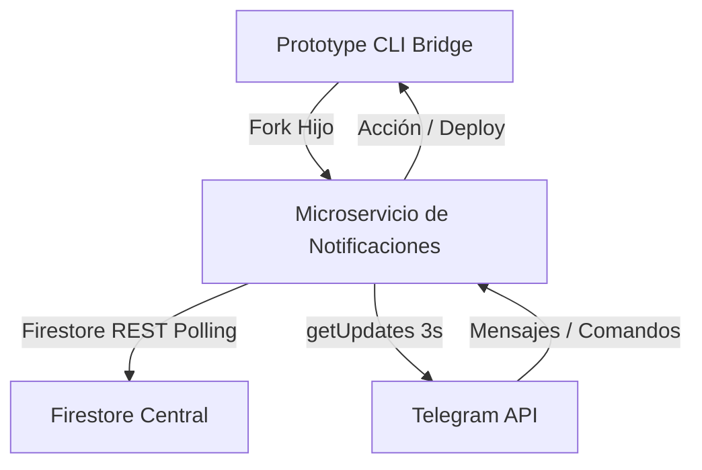

# Manual de Integración y Comandos Interactivos de Telegram (PROTOTIPE)

Este manual documenta la herramienta de integración con Telegram, su arquitectura, alcance, el ruteo inteligente por canales específicos y el funcionamiento de los comandos interactivos que permiten controlar y supervisar el ecosistema de **PROTOTIPE** directamente desde la aplicación de chat.

---

## 1. Arquitectura y Funcionamiento

El sistema de notificaciones omnicanal está diseñado bajo una arquitectura desacoplada y tolerante a fallos de red. Consta de dos elementos principales:



### 1.1 El Proceso Hijo (`notification_server.js`)
* Se ejecuta como un proceso hijo independiente (utilizando `fork` de Node.js) instanciado por el servidor central de la CLI (`server.js`).
* Si el proceso de notificaciones finaliza de forma inesperada, el servidor padre detecta la salida y lo reinicia automáticamente en 5 segundos.
* Al apagarse el servidor CLI, este se encarga de matar limpiamente el proceso hijo enviándole una señal `SIGTERM`.

### 1.2 Bypass de Reglas y Autenticación Resiliente
* En lugar de usar SDKs cliente tradicionales que requieren autenticación anónima insegura, el servicio lee la sesión activa del **Firebase CLI local** (`firebase-tools.json`).
* Utiliza el token de acceso de administrador OAuth2 para comunicarse directamente con la **Firestore REST API**, permitiendo consultar y actualizar las colecciones sin exponer credenciales en el cliente final.

---

## 2. Canales de Alertas y Alcance

El sistema soporta **5 canales independientes** para separar el tráfico de notificaciones. Si un subcanal no tiene credenciales configuradas, el microservicio utiliza de forma transparente los datos del **Canal General (Fallback)**.

| Canal | Propósito Técnico | Disparador Físico |
| :--- | :--- | :--- |
| **Canal General** | Notificaciones misceláneas y fallback general del sistema. | Eventos del sistema no clasificados. |
| **Crashes e Incidentes** | Telemetría de excepciones y estado de pings de salud. | Caídas de ping (Up/Down) y logs de error en `/api/notify/error`. |
| **Preventas y Leads** | Registro de preventa en el Briefing Studio. | Cuestionario completado y análisis de propuesta IA finalizado. |
| **Billing y Comisiones** | Facturación, mora de pago y reportes comisionales. | Sincronización de comisiones de Firebase y vencimiento de plazos. |
| **DevOps y Despliegues** | Integración continua, compilación y hosting. | Ejecución de `npm run build` y comandos de despliegue a Firebase. |

---

## 3. Guía de Configuración en Telegram

Para implementar la **Opción de Bots Dedicados**, sigue estos pasos estructurados:

### 3.1 Creación de los Bots en BotFather
Abre Telegram, busca al bot verificado **`@BotFather`** y crea los bots enviando el comando `/newbot`.
Asigna un nombre descriptivo y un username único terminado en `bot` para cada uno:
* **Bot General:** `@PrototipeSystemBot`
* **Bot de Crashes:** `@PrototipeCrashMonitorBot`
* **Bot de Preventas:** `@PrototipeBriefingBot`
* **Bot de Billing:** `@PrototipeBillingBot`
* **Bot de DevOps:** `@PrototipeDevOpsBot`

### 3.2 Obtención de los Chat IDs de Destino
* **Para Chats Privados (Solo tú):** Abre una conversación con el bot que creaste, pulsa **Iniciar** y luego consulta tu ID de usuario enviando un mensaje al bot auxiliar **`@userinfobot`** (ej: `882566128`).
* **Para Grupos Corporativos (Recomendado):** Crea tu grupo (ej: `[DevOps] Crashes e Incidentes`), añade a tu bot como miembro y añade temporalmente al bot **`@ShowJsonBot`** o realiza una consulta al endpoint de getUpdates del bot:
  ```text
  https://api.telegram.org/bot<TU_BOT_TOKEN>/getUpdates
  ```
  Busca el número de ID que empieza con un signo negativo (ej: `-1002234567890`).

---

## 4. Comandos Interactivos y Alcance

Cada bot cuenta con un escuchador activo que procesa peticiones en tiempo real (polling cada 3 segundos). Puedes consultarle a cualquiera de tus bots los siguientes comandos:

### 4.1 Comandos Generales y de Ayuda
* **`/help`** o **`/ayuda`** o **`/start`**
  * **Respuesta:** Muestra el panel interactivo del asistente con la lista completa de comandos disponibles y su sintaxis.

### 4.2 `/status` o `/salud`
* **Destinatario recomendado:** Bot de Crashes o Bot General.
* **Acción:** Realiza una lectura de la colección `health_checks` en Firestore.
* **Filtro y Deduplicación en Caliente:** Para evitar mostrar instancias duplicadas u obsoletas en el historial de la base de datos (por ejemplo, registros antiguos como `moni-app`), el bot primero consulta la colección de control `clientes_control` para identificar las instancias locales activas y cruza estos IDs en memoria.
* **Reconocimiento de Estado:** Traduce los estados `'up'` y `'green'` de Firestore al emoji verde `🟢`. Cualquier otro estado se representa con el emoji rojo `🔴`.
* **Respuesta:** Devuelve el estado de latencia, respuesta HTTP y validez de la PWA únicamente de las instancias SaaS de clientes activas.
* **Ejemplo de Salida:**
  > 🩺 **Estado de Salud de Instancias:**
  > 🟢 **VENTAS-MONI-APP**
  > • HTTP: `200`
  > • Latencia: `120 ms`
  > • PWA: `Sí ✓`

### 4.3 `/crashes` o `/errores`
* **Destinatario recomendado:** Bot de Crashes.
* **Acción:** Lee los últimos 5 fallos graves registrados en `app_failures`.
* **Respuesta:** Devuelve el cliente afectado, la ubicación exacta (componente/línea de código), el mensaje de excepción y la fecha del incidente formateada localmente en español mediante el helper `formatFirestoreDate`.

### 4.4 `/leads` o `/briefings`
* **Destinatario recomendado:** Bot de Preventas.
* **Acción:** Lee los últimos 5 cuestionarios del Briefing Studio registrados en Firestore.
* **Filtro de Borradores Incompletos:** El bot ignora registros incompletos o borradores de simulador. Solo selecciona y procesa cuestionarios que tengan el estado de finalización completo (`finalizado === true`, `status === 'completed'` o `progreso === 100`).
* **Respuesta:** Devuelve la empresa, nicho de negocio, puntaje de complejidad calculado por la IA, su cotización sugerida y la fecha de creación.

### 4.5 `/billing` o `/comisiones`
* **Destinatario recomendado:** Bot de Billing.
* **Acción:** Lee los últimos reportes financieros comisionales calculados por el ecosistema en `reportesBilling`.
* **Formateo de Fechas (Evitación de Invalid Date):** El bot utiliza el helper `formatFirestoreDate` que detecta y parsea objetos de tipo `Timestamp` de Firestore (soporta ejecuciones de `.toDate()`, propiedades `.seconds` y objetos de milisegundos), evitando fallos de "invalid date" en el chat.
* **Respuesta:** Devuelve el periodo, el total de comisiones, el estado de pago y la fecha de última actualización.

### 4.6 `/clientes`
* **Destinatario recomendado:** Bot de DevOps.
* **Acción:** Consulta al servidor CLI la lista física de directorios de clientes.
* **Procesamiento de Estructura por Plantillas:** Consume el endpoint local `/api/instancias/list`. Dado que el Bridge agrupa las instancias dentro de plantillas, la función `getClientInstancesList()` recorre recursivamente el árbol JSON para aplanar y extraer los `clientId` activos en la máquina local.
* **Respuesta:** Devuelve la lista de `clientId` válidos que puedes usar para despliegues.

### 4.7 `/deploy [cliente]`
* **Destinatario recomendado:** Bot de DevOps.
* **Acción:** Dispara el motor del CLI local en segundo plano para el cliente especificado.
* **Envío de Parámetro en POST Body:** Si no pasas argumento, te lista las opciones. Si especificas el ID del cliente, inicia el proceso DevOps. El bot realiza una llamada HTTP `POST` a `/api/project/deploy` enviando el `clientId` estructurado en formato JSON dentro del cuerpo de la petición (`POST body`) para satisfacer las reglas de validación estricta de parámetros del Bridge local, iniciando la purga de caché, compilación de producción (`npm run build`), auditoría de linter e inyección a Firebase Hosting. El bot de DevOps te reportará en el grupo cuando la compilación termine con éxito o falle.

### 4.8 `/maintenance` o `/mantenimiento`
* **Acción:** Gestiona el modo de mantenimiento de los clientes locales.
* **Flujo:** Si se ejecuta sin argumentos, lista los clientes activos con botones individuales. Al seleccionar uno, consulta su estado en Firestore Central. Presenta botones interactivos para **Activar** (`🟢`) o **Desactivar** (`🔴`) el mantenimiento, actualizando instantáneamente la configuración en la base de datos de producción.

### 4.9 `/tasks` o `/tareas`
* **Acción:** Consulta y gestiona las tareas pendientes del roadmap (`tareas_pendientes.md`).
* **Interacción:** Muestra las primeras 8 tareas pendientes del Roadmap. Asocia a cada tarea un botón `✅ Completar [ID]`. Tocar un botón tacha y completa de forma automática la línea correspondiente en el archivo local de la máquina.

### 4.10 `/addtask [cuerpo]`
* **Acción:** Agrega una tarea nueva a `tareas_pendientes.md` de manera remota.
* **Sintaxis:** `/addtask [Dominio] Descripción` (ej. `/addtask CLI Corregir script`). Si se omite el dominio, se asigna `CORE` por defecto. El sistema calcula de forma autónoma el siguiente número secuencial disponible.

### 4.11 `/integrity` o `/diagnostico`
* **Acción:** Ejecuta el analizador de integridad física del repositorio.
* **Visualización:** Informa sobre desvíos en el mapa de aplicación (`codeDrifts`), roadmap e historial de Git. Si se detectan inconsistencias, presenta un botón rápido `⚡ Auto-healer (Fix-Map)` que ejecuta el auto-curador del Bridge para resolver las fallas de indexación de inmediato.

### 4.12 `/logs`
* **Acción:** Muestra las últimas 20 líneas en caliente del log del servidor Bridge actual.
* **Funcionamiento:** Escanea la carpeta de tareas de Gemini en la máquina, localiza de manera dinámica la bitácora activa del microservicio y renderiza el extracto en una caja de código formateada en HTML.

---

## 5. Botones Interactivos (Inline Keyboards)

El sistema soporta botones interactivos en Telegram (**Inline Keyboards**) a través de **Callback Queries**. 

* **Comando `/ayuda`:** Además del texto del catálogo de comandos, el bot adjunta una cuadrícula de botones interactivos de 2 columnas (`🩺 Salud`, `🚨 Errores`, `📝 Preventas`, `💰 Facturación`, `📦 Clientes CLI`, `🛠️ Mantenimiento`, `📋 Tareas Roadmap`, `🔍 Diagnóstico`, `🪵 Ver Logs`). Al tocarlos, Telegram ejecuta internamente el comando correspondiente y refresca la información de inmediato sin que el usuario tenga que escribir nada.
* **Comandos `/clientes` y `/deploy`:** Si ejecutas estos comandos desde el bot de DevOps, se te presentará una lista de botones con formato `🚀 Desplegar [id_cliente]`. Tocar un botón dispara automáticamente la compilación y el despliegue del hosting para ese cliente específico de manera 100% interactiva.
* **Gestiòn de Tareas y Mantenimiento:** Los botones dinámicos de `/tasks` y `/maintenance` permiten interactuar directamente con la consola sin teclear un solo comando, conmutando estados lógicos y físicos en caliente.

---

## 6. Mecanismo de Seguridad y Refresco OAuth2 (Bypass REST)

El motor local realiza consultas directas a las colecciones de Firestore Central utilizando la API REST de Google Cloud. Para evitar la expiración del token de sesión de Firebase CLI (el cual expira cada 1 hora):

1. **Lectura de Sesión Activa:** El servidor lee el `refresh_token` directamente desde el archivo de configuración global de Firebase CLI (`~/.config/configstore/firebase-tools.json`).
2. **Refresco con Client Secret:** Cuando el token `access_token` expira, el servidor realiza un refresco asíncrono consultando `https://oauth2.googleapis.com/token` utilizando el Client ID oficial de la CLI (`563584335869-fgrhgmd47bqnekij5i8b5pr03ho849e6.apps.googleusercontent.com`) y su Client Secret correspondiente (`j9iVZfS8kkCEFUPaAeJV0sAi`).
3. **Idempotencia y Caché:** El nuevo token se guarda en memoria y se actualiza en el archivo de configuración para reuso en consultas subsecuentes.

---

## 7. Estructura de Configuración Local (`notification_config.json`)

Para configurar las credenciales locales de los subcanales del bot, el microservicio escribe y consulta el archivo de caché física `Prototipe-CLI/notification_config.json` estructurado con la siguiente especificación de metadatos:

```json
{
  "alertsEnabled": true,
  "telegramToken": "TOKEN_BOT_GENERAL",
  "telegramChatId": "ID_CHAT_GENERAL",
  "discordWebhookUrl": "URL_WEBHOOK_DISCORD",
  "channels": {
    "crashes": {
      "telegramToken": "TOKEN_BOT_CRASHES",
      "telegramChatId": "ID_CHAT_CRASHES",
      "discordWebhookUrl": "",
      "enabled": true
    },
    "briefings": {
      "telegramToken": "TOKEN_BOT_BRIEFINGS",
      "telegramChatId": "ID_CHAT_BRIEFINGS",
      "discordWebhookUrl": "",
      "enabled": true
    },
    "billing": {
      "telegramToken": "TOKEN_BOT_BILLING",
      "telegramChatId": "ID_CHAT_BILLING",
      "discordWebhookUrl": "",
      "enabled": true
    },
    "devops": {
      "telegramToken": "TOKEN_BOT_DEVOPS",
      "telegramChatId": "ID_CHAT_DEVOPS",
      "discordWebhookUrl": "",
      "enabled": true
    }
  }
}
```

* **Nota de Fallback:** Si un subcanal no tiene definidos sus campos de token o chat ID, o si la propiedad `enabled` es `false`, el microservicio redirigirá automáticamente el tráfico de alertas al `telegramToken` y `telegramChatId` generales del raíz.

---

## 8. Mantenimiento y Solución de Problemas

* **Logs del Servicio:** Puedes auditar las entradas de los comandos interactivos y la llegada de mensajes de callback viendo el archivo de log en caliente del microservicio:
  `C:\Users\Sergio\.gemini\antigravity\brain\<conv_id>\.system_generated\tasks\` (revisa el log de la tarea activa del CLI). También puedes consultarlos de forma remota enviando `/logs` en el chat.
* **Configuración Guardada:** Las credenciales de cada canal se persisten tanto en Firestore (`configuracion_sistema/monitoreo`) como en el archivo local de caché del CLI `Prototipe-CLI/notification_config.json`.
* **Errores de Red:** Si la API de Telegram falla temporalmente (Error 400 o 502), el microservicio atrapa la excepción de forma silenciosa para evitar romper el flujo de polling de Firestore y reintenta la sincronización en el siguiente ciclo.
