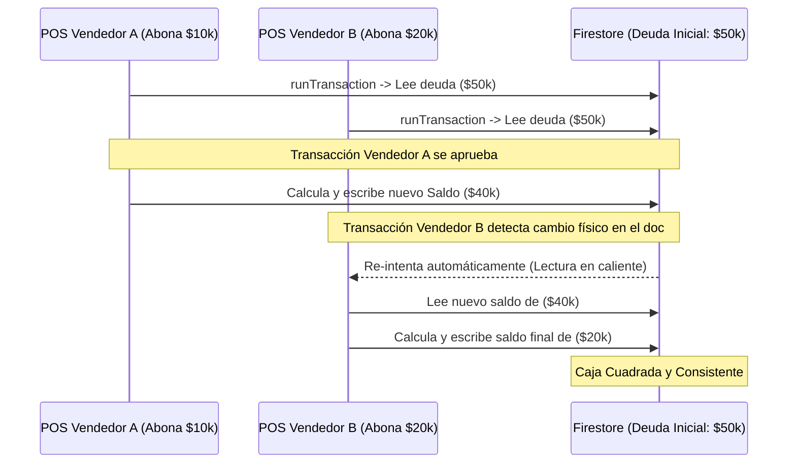

# Manual de Desarrollo: Motor Financiero Transaccional de Créditos y Saldos

## 1. Propósito y Visión General
El servicio de **Créditos y Saldos** (`creditService.js`) provee un motor financiero B2B/B2C para la administración segura de cupos de endeudamiento, amortizaciones y abonos parciales. Su función crítica es garantizar la consistencia matemática absoluta del dinero en caja, blindando la base de datos contra inconsistencias causadas por escrituras concurrentes.

---

## 2. Arquitectura de Transacción y Mitigación de Condiciones de Carrera

En flujos financieros con múltiples cajeros o administradores cobrando en paralelo, es común que ocurran colisiones de datos (inconsistencias por escrituras concurrentes). El motor mitiga esto utilizando el protocolo de **Transacciones de Firestore (`runTransaction`)**:



### Algoritmo de Transacción Atómica
El motor se ejecuta de forma aislada e inalterable. Primero lee el documento actual en su snapshot físico en el servidor, realiza las sumas y restas en memoria y luego aplica el bloque de cambios a Firestore. Si detecta que otra consola modificó el documento entre la lectura y la escritura, aborta y vuelve a intentar de forma automática sin arrojar error al usuario.

```javascript
const nuevoAbono = {
  monto: paymentData.monto,
  nota: paymentData.nota,
  fecha: new Date().toISOString()
};

// Evita saldos negativos asegurando un límite en 0
const nuevoSaldo = Math.max(0, data.saldoPendiente - paymentData.monto);
const nuevoEstado = nuevoSaldo === 0 ? 'pagado' : 'activo';
```

---

## 3. Guía de Integración Técnica en Caliente

### Paso 1: Configurar la Colección de Crédito
Al momento de crear un pedido a crédito en el Checkout, se genera el documento inicial con saldo pendiente igual al total del pedido y estado `activo`:

```javascript
const newCreditDocument = {
  orderId: 'ORDER-9832',
  orderNumber: 'SF-1029',
  clienteCelular: '3001234567',
  clienteNombre: 'Sergio',
  totalOriginal: 50000,
  saldoPendiente: 50000,
  estado: 'activo',
  abonos: [],
  createdAt: new Date()
};
```

### Paso 2: Invocar Abono desde el Panel POS
Conecta el botón de caja del vendedor con la biblioteca transaccional inyectando el callback de notificaciones:

```javascript
import { addPaymentToCredit } from './creditService';
import { db } from './firebaseConfig';

const registrarCobro = async () => {
  await addPaymentToCredit({
    config: { db, collectionCredits: 'credits', collectionOrders: 'orders' },
    creditId: 'CREDIT-DOC-ID',
    paymentData: { monto: 10000, nota: 'Abonó en efectivo en caja 1' },
    onPaymentApplied: async (creditData, abono) => {
      // Dispara SMS, WhatsApp o notificación interna de abono al instante
      console.log(`Abono de ${abono.monto} registrado con éxito.`);
    }
  });
};
```

---

## 4. Preguntas Frecuentes y Solución de Problemas (Troubleshooting)

#### ❓ Firestore me da error "Transaction failed: Every document read must be updated..."
Esta es una regla estricta de las transacciones de Google Cloud Firestore. Si realizas una lectura (`transaction.get`) de un documento dentro de una transacción, **estás obligado** a realizar una escritura/actualización (`transaction.update` o `transaction.set`) de ese mismo documento antes de finalizar el bloque. El motor cumple esto estrictamente actualizando el crédito al final de la lectura.

#### ❓ El saldo pendiente me quedó con decimales o negativo
El motor blinda la caja aplicando la envoltura protectora matemática `Math.max(0, saldoPendiente - monto)`. Esto garantiza que, si un cliente debe $15,000 e ingresas por error un abono de $20,000, el saldo resultante se ancle a **cero** y el estado pase a **pagado**, impidiendo saldos a favor descontrolados en este flujo.
