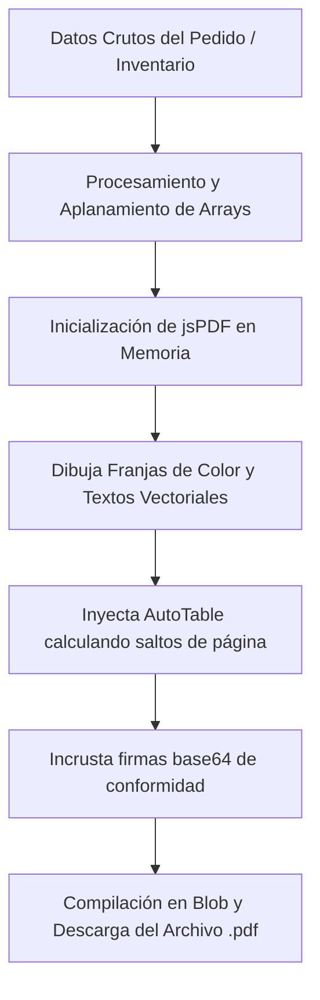

# Manual de Desarrollo: Motor de Generación de Documentos PDF Premium

## 1. Propósito y Visión General
El servicio de **Generación de Documentos PDF** (`pdfService.js`) resuelve la necesidad de emitir y entregar físicamente a clientes y administradores informes estructurados de alta fidelidad, listos para impresión y descarga. 

Al abstraer la biblioteca vectorial `jsPDF` y su plugin de tablas `jsPDF-AutoTable`, este motor permite inyectar marcas corporativas en caliente y renderizar grillas ejecutivas de métricas.

---

## 2. Arquitectura de Renderizado y Flujo Vectorial

El flujo opera renderizando capas vectoriales directamente en la memoria local del navegador:



### Gestión Dinámica de Coordenadas de Página (Eje Y)
A diferencia de HTML, jsPDF no tiene reflujo automático de texto (reflow). Todo elemento se dibuja en coordenadas cartesianas $(X, Y)$ en milímetros en base a una página estándar A4 de $210 \times 297 \text{ mm}$.

Para evitar solapamientos y calcular dónde colocar la firma digital al final de una tabla cuya longitud es variable (pudiendo ocupar 1, 2 o más páginas), el motor lee el metadato del plugin AutoTable:

```javascript
// Obtiene la posición vertical exacta del borde inferior de la última fila de la tabla
const finalY = (result && result.lastY) ? result.lastY + 15 : 150;

// Si el bloque de firma de conformidad excede la altura física de la página A4 (297mm)
if (finalY + 45 > 297) {
  doc.addPage(); // Genera automáticamente una nueva página
  // Dibuja en la parte superior de la página 2
} else {
  // Dibuja a continuación de la tabla en la misma página 1
}
```

---

## 3. Guía de Integración Paso a Paso

### Paso 1: Mapear Estructuras para Tablas
AutoTable requiere que la información de entrada sea un array bidimensional plano `Array[Array[]]`. Debes formatear y aplanar tus objetos dinámicos antes de invocar el servicio:

```javascript
const headers = [['Código', 'Producto', 'Variante', 'Cant', 'Subtotal']];
const dataset = pedido.productos.map(p => [
  p.id.toUpperCase(),
  p.nombre,
  p.varianteName,
  p.cantidad,
  formatCurrency(p.precio * p.cantidad)
]);
```

### Paso 2: Configurar y Descargar
Invoca la función declarativa de la biblioteca inyectando la paleta RGB de tu nuevo cliente:

```javascript
import { exportSalesReportPDF } from './pdfService';

exportSalesReportPDF({
  title: 'Reporte Financiero Tienda Central',
  primaryColor: [4, 120, 87], // Verde Esmeralda corporativo
  headers: headers,
  data: dataset,
  metrics: { ... },
  formatFn: (val) => `$ ${val}`
});
```

---

## 4. Preguntas Frecuentes y Solución de Problemas (Troubleshooting)

#### ❓ El PDF crashea al incrustar la firma digital
Asegúrate de que la firma se pase como una cadena en formato URI Base64 (`data:image/png;base64,...`). Si intentas inyectar un canvas directo del DOM sin rasterizar, jsPDF lanzará una excepción fatal en consola.

#### ❓ Las celdas de textos largos se recortan en las tablas
Por defecto, AutoTable aplica `overflow: 'ellipsize'` en las celdas para evitar desbordamientos horizontales. Si deseas que los textos largos se expandan en varias líneas verticales dentro de la misma celda, configura el estilo `cellWidth: 'wrap'` en la propiedad `styles` del servicio.
