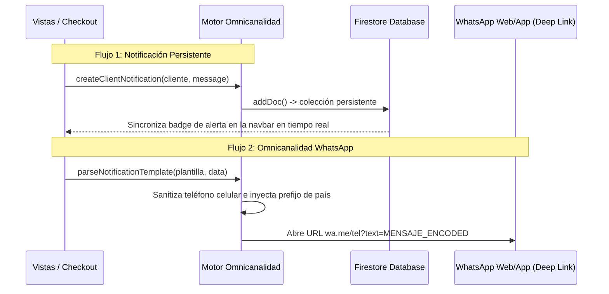

# Manual de Desarrollo: Motor de Omnicanalidad y Plantillas de Mensajería Dinámica

## 1. Propósito y Visión General
El **Motor de Omnicanalidad** unifica las notificaciones persistentes de la base de datos con la mensajería del canal directo al cliente por **WhatsApp**. Resuelve la necesidad de enviar plantillas informativas de pedidos o facturas sin incurrir en los costos elevados de la API oficial de WhatsApp Business (WABA).

Permite orquestar la sanitización de números internacionales e inyectar variables en tiempo real en los textos.

---

## 2. Arquitectura Conversacional y Flujo de Datos

El motor opera bajo dos flujos independientes que se complementan en el checkout o en la administración:



### Sanitización y Formateo Internacional
El motor es multi-país y agnóstico. Al recibir el número telefónico, realiza una sanitización atómica en el DOM:
1. **Sanitización Regex:** `replace(/\D/g, '')` remueve todos los caracteres especiales, espacios, guiones y símbolos `+` o `()`.
2. **Formateo de Prefijo:** Si la longitud del celular es de 10 dígitos (estándar para muchos países como Colombia o México), el motor antepone de forma dinámica el `defaultCountryCode` configurado. Esto evita que se abran chats rotos.

---

## 3. Guía de Integración Técnica

### Paso 1: Definir las Plantillas en tu Configuración
En tu store o base de datos central de marca base, define las cadenas de plantilla con llaves `{}`:

```javascript
const templates = {
  orderReceived: '¡Hola {cliente}! Hemos recibido tu pedido #{pedidoId} por un total de {monto}. Rastrealo en vivo en: {trackingUrl}',
  stockAlert: '⚠️ ALERTA DE STOCK: El producto {producto} en su variante {variante} ha bajado de su umbral. Stock actual: {stock}.'
};
```

### Paso 2: Parsear e Inyectar Variables en Caliente
Inyecta la data del pedido en el formateador del motor de la biblioteca:

```javascript
import { parseNotificationTemplate, openWhatsAppChat } from './omnicanalidad';

const mensaje = parseNotificationTemplate(templates.orderReceived, {
  cliente: 'Sergio Agudelo',
  pedidoId: 'SF-9382',
  monto: '$ 45.000 COP',
  trackingUrl: 'https://app.ventas/tracking?t=uuid-token'
});

// Abre el chat en una pestaña nueva
openWhatsAppChat({
  phone: '3001234567',
  message: mensaje,
  defaultCountryCode: '57' // Colombia
});
```

---

## 4. Preguntas Frecuentes y Solución de Problemas (Troubleshooting)

#### ❓ El navegador bloquea la ventana de WhatsApp al abrirse
Este es un comportamiento nativo de seguridad de algunos navegadores móviles frente a `window.open` si se dispara asíncronamente (dentro de una promesa o llamada de red lenta). Para evitarlo, asegúrate de que `openWhatsAppChat` se ejecute inmediatamente después de la acción de clic del usuario, o abre la pestaña vacía primero y actualiza su ubicación al finalizar la promesa.

#### ❓ El prefijo de país no se inyecta correctamente
El motor inyecta el prefijo únicamente si la longitud del número sanitizado es de exactamente 10 dígitos. Si tu cliente ingresa el número con el código de país ya escrito (ej. `573001234567`), el motor respetará el número y no inyectará duplicados.
