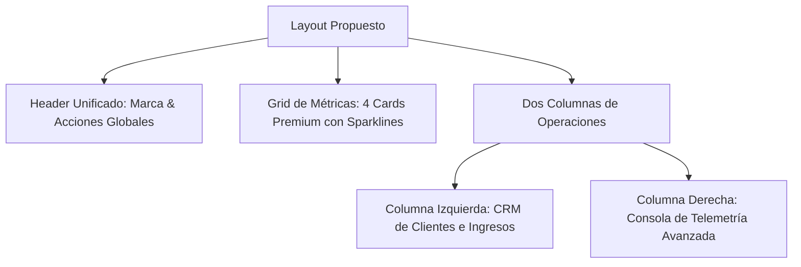

# 🎨 Propuesta de Rediseño Premium: Consola Central Ecosistema (PROTOTIPE)

Esta propuesta técnica detalla las optimizaciones visuales y de diseño de interfaz (UI/UX) para la **Consola Central Ecosistema** (Dashboard de Desarrollador). El objetivo es alinear la estética del panel de control con la identidad tecnológica de **PROTOTIPE** (agilidad, robustez, multitenancy y modernidad) sin alterar la funcionalidad existente.

---

## 🌟 Identidad de Marca y Concepto Visual: PROTOTIPE

El dashboard del desarrollador es el **"Cockpit de Vuelo"** desde donde se controlan los negocios activos en producción. Por ello, la interfaz debe proyectar precisión técnica y estética premium:

1. **Paleta de Colores (Glow & Tech):**
   * **Base Oscura:** `#070b13` (Espacio profundo/Fondo principal) y `#0f172a` (Superficie de tarjetas/contenedores).
   * **Acento Primario (Indigo):** `#6366f1` (Branding core, acciones principales, estados activos).
   * **Acento Secundario (Purple):** `#a855f7` (Bordes interactivos, telemetría y elementos Pro).
   * **Glow/Estados:** Gradientes de Indigo a Púrpura (`from-indigo-500 to-purple-600`) para botones críticos y estados exitosos.

2. **Tipografía:**
   * Utilizar **Outfit** (sans-serif) para títulos y números grandes (métrica limpia y moderna).
   * Utilizar **JetBrains Mono** o **Fira Code** para la consola de telemetría y códigos de token, acentuando el aspecto técnico "developer-first".

3. **Efectos Glassmorphic y Bordes Suaves:**
   * Sustituir los bordes opacos por bordes semitransparentes con efecto vidrio: `border border-white/[0.06] backdrop-blur-md`.
   * Sombras suaves de color de acento (`box-shadow` difuso de tono índigo) sobre las tarjetas principales para crear profundidad en tres dimensiones (Z-index visual).

---

## 📐 Cambios Estructurales y de Distribución (Layout)



### 1. Header de Página (Menos Saturación, Más Foco)
* **Actual:** El título "Panel de Comisiones y Facturación" ocupa un banner gigante con tres botones incrustados a la derecha.
* **Propuesta:** 
  * Mover las herramientas técnicas de desarrollador (`Enviar Telemetría de Prueba`, `Alternar Entorno`) a un menú colapsable o barra de utilidades flotante para limpiar la vista ejecutiva.
  * Mantener el botón principal `+ Nuevo Aprovisionamiento` destacado con un degradado de marca animado que reaccione al hover.

### 2. Tarjetas de Métricas (Jerarquía Numérica)
* **Visual Premium:** En lugar de cajas planas, las métricas deben usar un diseño de "Glow Card":
  * El número (`$0`, `1`) se destaca en tamaño extra-grande (`text-4xl`) con tipografía **Outfit** y tracking ajustado.
  * Añadir un pequeño gráfico de tendencia de fondo (Sparkline) difuminado en color de acento para indicar actividad de comisiones históricas.

### 3. CRM de Clientes y Reparto de Comisiones (Columna Izquierda)
* **Actual:** Una barra de progreso plana morada con un avatar simple.
* **Propuesta:**
  * Reemplazar la barra plana por una barra de progreso de gradiente dinámico (`bg-gradient-to-r from-indigo-500 to-purple-500`) con esquinas redondeadas y micro-sombra.
  * El badge avatar del cliente (`VE`) debe usar un gradiente aleatorio derivado de la configuración HSL del cliente para dar identidad visual propia en la lista.
  * Añadir un menú contextual de tres puntos en cada fila para desplegar acciones rápidas sin ocupar espacio visual fijo:
    * 📄 Generar PDF de factura.
    * 💬 Enviar liquidación por WhatsApp.
    * 🌐 Inspeccionar Shard.

### 4. Consola de Telemetría (Estética de Terminal Real)
* **Actual:** Una caja oscura simple con logs en verde.
* **Propuesta:**
  * Estructurar el panel como una pestaña de terminal de desarrollador real (pestañas de archivo ficticias, cabecera de ventana con botones de minimizar/cerrar en rojo, amarillo y verde).
  * Colorización sintáctica estricta por tipo de log:
    * `Éxito`: `#10b981` (Esmeralda)
    * `Advertencia`: `#f59e0b` (Ámbar)
    * `Error`: `#ef4444` (Rojo)
    * `Info`: `#60a5fa` (Azul cielo)
  * Añadir buscador interno rápido de logs y botón de "Limpiar Pantalla" y "Copiar Logs" con iconos minimalistas integrados.

---

## ✨ Micro-Interacciones y Transiciones Sugeridas (Tailwind CSS v4)

* **Hover en Tarjetas:** Elevación suave en el eje Y y resplandor sutil en el borde:
  ```css
  .hover-glow-card {
    transition: transform 0.2s cubic-bezier(0.16, 1, 0.3, 1), box-shadow 0.2s ease;
  }
  .hover-glow-card:hover {
    transform: translateY(-2px);
    box-shadow: 0 10px 30px -10px rgba(99, 102, 241, 0.15);
    border-color: rgba(99, 102, 241, 0.3);
  }
  ```
* **Botón Nuevo Aprovisionamiento:** Efecto de gradiente fluido en hover mediante transición de variables HSL o traslación de fondo.
* **Consola de Telemetría:** Entrada animada de nuevos logs mediante scroll-fade suave y parpadeo de cursor al final de la línea.
