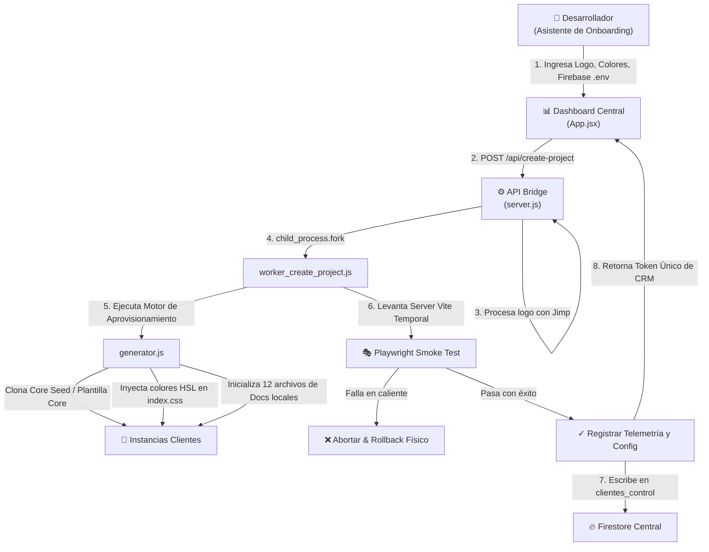
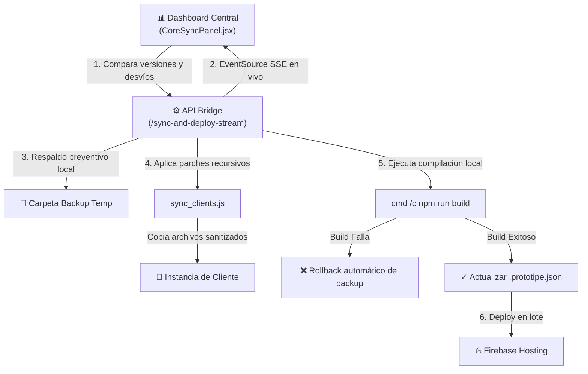
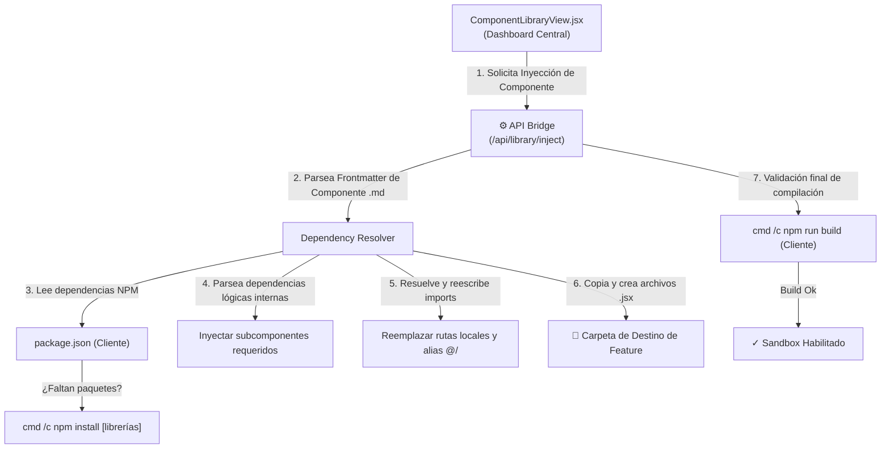
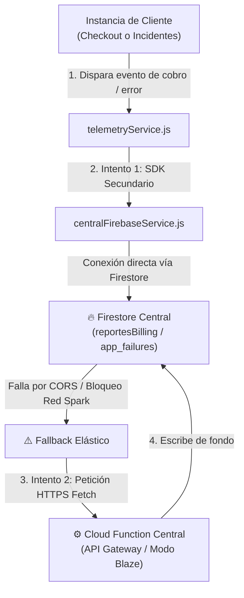
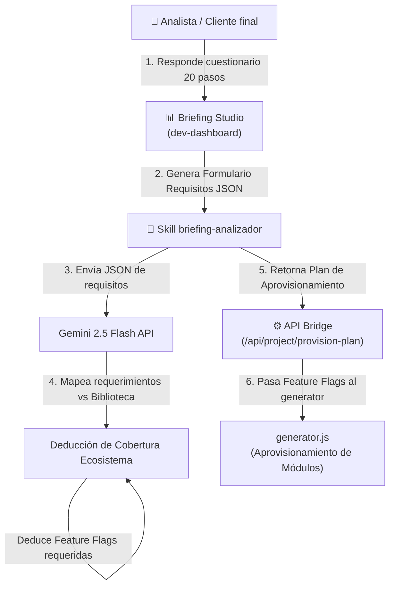
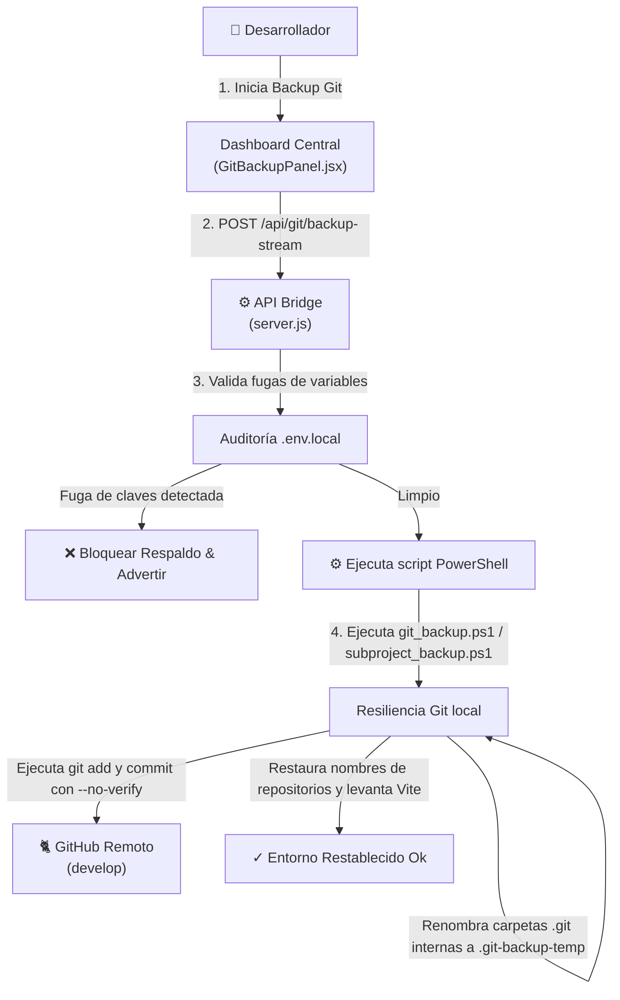

# 🗺️ DIAGRAMA DE FLUJO GENERAL Y ARQUITECTURA DEL ECOSISTEMA PROTOTIPE

Este documento presenta la interconexión técnica y flujo de datos de todos los componentes mapeados y documentados en el Ecosistema PROTOTIPE (excluyendo la lógica específica de negocio de las aplicaciones cliente).

```mermaid
flowchart TB
    %% Estilos de Nodos
    classDef script fill:#1e1b4b,stroke:#818cf8,stroke-width:1px,color:#e0e7ff;
    classDef cli fill:#0f172a,stroke:#38bdf8,stroke-width:1px,color:#f0f9ff;
    classDef ui fill:#1e293b,stroke:#a78bfa,stroke-width:1px,color:#f5f3ff;
    classDef db fill:#14532d,stroke:#34d399,stroke-width:1px,color:#ecfdf5;
    classDef folder fill:#581c87,stroke:#c084fc,stroke-width:1px,color:#faf5ff;

    %% 📂 CARPETAS FÍSICAS (Windows)
    subgraph Carpetas ["📁 Carpetas y Disco Físico (Windows D:/PROTOTIPE)"]
        FCores["📂 Plantillas Core<br>(App Ventas, etc.)"]:::folder
        FInstancias["📂 Instancias Clientes<br>(Instancias de Clientes)"]:::folder
        FDocs["📂 Documentacion PROTOTIPE<br>(Roadmaps, Estándares, Diccionario)"]:::folder
    end

    %% 💻 SCRIPTS DE SOPORTE (Raíz)
    subgraph ScriptsRaiz ["💻 Scripts de Soporte y Backup"]
        SBackupBat["backup.bat<br>(Entrada Windows)"]:::script
        SMenuBackup["menu_backup.ps1<br>(Menú interactivo)"]:::script
        SGitBackup["git_backup.ps1<br>(Snapshot maestro)"]:::script
        SSubprojectBackup["subproject_backup.ps1<br>(Snapshot individual)"]:::script
        
        SBackupBat -->|Ejecuta bypass| SMenuBackup
        SMenuBackup -->|Orquesta| SGitBackup
        SMenuBackup -->|Orquesta| SSubprojectBackup
    end

    %% ⚙️ MOTOR CLI (Prototipe-CLI)
    subgraph MotorCLI ["⚙️ Motor CLI & API Bridge (Puerto 3001)"]
        CLServer["server.js<br>(Express Server & SSE Streams)"]:::cli
        CLGenerator["generator.js<br>(Aprovisionador Físico)"]:::cli
        CLWorker["worker_create_project.js<br>(Subproceso del Motor de Aprovisionamiento)"]:::cli
        CLSyncTemplates["sync_templates.js<br>(Sincronizador Universal)"]:::cli
        CLSyncClients["sync_clients.js<br>(Downstream Patching)"]:::cli
        CLTestTemplates["test_templates.js<br>(Certificación de Compilación)"]:::cli
        CLConfig["config.js<br>(Rutas y Esquemas)"]:::cli
        CLLogger["logger.js<br>(cli_bridge.log)"]:::cli
        
        CLServer -->|Invoca IPC Fork| CLWorker
        CLWorker -->|Consume| CLGenerator
        CLServer -->|Invoca| CLSyncTemplates
        CLServer -->|Invoca| CLSyncClients
        CLSyncClients -->|Rollback temporal| CLWorker
        CLSyncTemplates -->|Valida| CLTestTemplates
        CLGenerator -->|Genera| FInstancias
        CLSyncClients -->|Parche diferencial| FInstancias
    end

    %% 📊 CONSOLA CENTRAL (dev-dashboard React UI)
    subgraph DashboardUI ["📊 Dashboard Central (dev-dashboard)"]
        AppJSX["App.jsx<br>(Monolito Central)"]:::ui
        
        %% Componentes de Admin
        CCard["CoreCard.jsx<br>(Deploy individual / Fixes)"]:::ui
        CManager["CoreManagerPanel.jsx<br>(Gestión Plantillas)"]:::ui
        CSync["CoreSyncPanel.jsx<br>(Sync & Deploy SSE en Lote)"]:::ui
        CE2E["E2EPanel.jsx<br>(Tests Playwright SSE)"]:::ui
        CGit["GitBackupPanel.jsx<br>(Control Versiones SSE)"]:::ui
        CLibrary["ComponentLibraryView.jsx<br>(Catálogo de Componentes)"]:::ui
        CSandbox["ComponentSandbox.jsx<br>(Sandbox de Componentes dinámicos)"]:::ui
        CRecaudo["RecaudoPanel.jsx<br>(Cartera & WhatsApp Alerts)"]:::ui
        CCobros["CobrosPanel.jsx<br>(Cobros & Reversiones Drawers)"]:::ui
        CHealth["HealthRadar.jsx<br>(Live Sonar Monitor)"]:::ui
        
        %% Hooks y Servicios
        HPdf["pdfService.js<br>(Generador PDFs)"]:::ui
        HToast["useToast.js"]:::ui
        HClipboard["useCopyToClipboard.js"]:::ui

        AppJSX --> CManager
        AppJSX --> CSync
        AppJSX --> CE2E
        AppJSX --> CGit
        AppJSX --> CLibrary
        AppJSX --> CSandbox
        AppJSX --> CRecaudo
        AppJSX --> CCobros
        AppJSX --> CHealth
        CManager --> CCard
        
        AppJSX --> HPdf
        AppJSX --> HToast
        AppJSX --> HClipboard
    end

    %% ☁️ SERVICIOS EXTERNOS & APIS
    subgraph ServiciosExternos ["☁️ Conexiones y APIs Externas"]
        FirebaseCentral["🔥 Firebase Central (Control SaaS)<br>· Auth (Desarrollador)<br>· Firestore (Telemetría / Comisiones)<br>· Hosting (Publicación)"]:::db
        GitHub["🐈 GitHub Remoto<br>(Origin / Branches)"]:::db
        PlaywrightTech["🎭 Playwright Headless<br>(Smoke Tests)"]:::db
        GeminiAPI["🧠 Gemini 2.5 Flash API<br>(Personalización de Requisitos)"]:::db
    end

    %% Conexiones Cruzadas de Datos
    AppJSX <-->|Autenticación y Pings| FirebaseCentral
    AppJSX <-->|API REST / EventSource SSE| CLServer
    CSync <-->|Streaming de compilación/despliegue| CLServer
    CGit <-->|Streaming de snapshots Git| CLServer
    CE2E <-->|Streaming de logs de testing| CLServer
    CLGenerator <-->|REST API Register / SDK config| FirebaseCentral
    CLGenerator <-->|Jimp Logo Resize| FInstancias
    CLWorker <-->|smoke tests headles| PlaywrightTech
    CLServer <-->|Auto-detección y Web Apps| FirebaseCentral
    CLServer <-->|Análisis cognitivo de briefing| GeminiAPI
    CLServer <-->|Git CLI operations| GitHub
    SSubprojectBackup & SGitBackup <-->|Push de snapshots| GitHub
    CCard -->|Firebase Hosting deploy| FirebaseCentral
    CSync -->|Firebase Hosting deploy batch| FirebaseCentral

    %% Flujos físicos
    SSubprojectBackup -->|Lee/escribe| FInstancias
    SGitBackup -->|Respalda maestro| Carpetas
    FDocs -->|Guarda informes y logs| FDocs
```

---

## 🔀 Secuencias Operativas Clave del Ecosistema

### 1. Flujo de Aprovisionamiento de Instancias de Clientes (Bootstrap)

El proceso de creación y aprovisionamiento de un nuevo cliente automatiza el andamiaje técnico y la validación en caliente de la compilación.

**Secuencia Detallada:**
1. El usuario interactúa con el Asistente de Onboarding en [`App.jsx`](file:///d:/PROTOTIPE/Central%20PROTOTIPE/dev-dashboard/src/App.jsx).
2. Sube el logo comercial, el cual es procesado y optimizado por la API Bridge [`server.js`](file:///d:/PROTOTIPE/Prototipe-CLI/server.js) vía Jimp y guardado físicamente en `/public`.
3. El desarrollador ingresa las credenciales de Firebase. Se llama a `/api/firebase/validate` para certificar la clave en caliente.
4. Se pulsa "Crear Proyecto", lo cual dispara una petición POST a `/api/create-project`.
5. La API Bridge levanta un subproceso asíncrono (`child_process.fork`) de [`worker_create_project.js`](file:///d:/PROTOTIPE/Prototipe-CLI/worker_create_project.js).
6. El worker ejecuta el Motor de Aprovisionamiento [`generator.js`](file:///d:/PROTOTIPE/Prototipe-CLI/generator.js), el cual clona la Plantilla Core correspondiente en [`Instancias Clientes`](file:///d:/PROTOTIPE/Instancias%20Clientes), inyecta los colores HSL en `src/index.css`, actualiza los metadatos de nicho, PWA y SEO e inicializa 12 archivos obligatorios de documentación local.
7. El worker ejecuta la suite de Smoke Tests locales (`Playwright`) en un servidor Vite temporal para certificar que el bundle no arroja excepciones de React.
8. Una vez certificado, registra la telemetría en Firestore Central de Control y retorna el token único.

---

### 2. Flujo de Sincronización Downstream (Core → Clientes)

Permite propagar de forma segura actualizaciones y parches de código desde las Plantillas Core hacia múltiples Instancias de Clientes seleccionadas en lote.

**Secuencia Detallada:**
1. [`CoreSyncPanel.jsx`](file:///d:/PROTOTIPE/Central%20PROTOTIPE/dev-dashboard/src/components/admin/CoreSyncPanel.jsx) consulta las instancias instaladas en el disco local y las contrasta contra sus plantillas Core.
2. El usuario selecciona los clientes a parchar e inicia la sincronización.
3. Se conecta al canal SSE `/api/instancias/sync-and-deploy-stream`.
4. La API Bridge realiza backups temporales preventivos de los archivos modificados.
5. Copia físicamente las actualizaciones del core a las instancias de clientes respetando sus archivos locales de identidad de marca (.env, logos, etc.) usando [`sync_clients.js`](file:///d:/PROTOTIPE/Prototipe-CLI/sync_clients.js).
6. Ejecuta `npm run build` local en cada instancia. Si el build falla, realiza un rollback automático restaurando el backup temporal. Si tiene éxito, actualiza `.prototipe.json` y ejecuta el deploy automático a Firebase Hosting.

---

### 3. Flujo de Inyección Inteligente de Componentes (Dependency Resolver)

Este flujo expone el proceso mediante el cual el Dashboard Central lee metadatos e inyecta componentes de la biblioteca resolviendo colisiones NPM y de imports de forma dinámica.

**Secuencia Detallada:**
1. El usuario selecciona un componente del catálogo en `ComponentLibraryView.jsx` y pulsa "Portar Componente" (activando la skill `portar-componente`).
2. El Dashboard Central envía el payload a la API Bridge en `/api/library/inject` con la ruta de destino deseada.
3. La API Bridge lee el Frontmatter del Markdown de la biblioteca, extrayendo el array de dependencias NPM y dependencias internas locales.
4. El backend lee el `package.json` de la Instancia de Cliente destino. Si se detectan dependencias externas faltantes, ejecuta de forma síncrona `npm install` de las librerías requeridas.
5. Se copian los archivos `.jsx` del componente, parseando en caliente el código para adaptar los `imports` relativos a la nueva jerarquía de carpetas del cliente, normalizando alias de rutas (`@/components/...`).
6. Se inyectan en cascada los subcomponentes atómicos requeridos y se registra el Sandbox interactivo en `ComponentSandbox.jsx`.
7. Se ejecuta `npm run build` en el cliente destino para garantizar estabilidad estructural antes de marcar la tarea como completada.

---

### 4. Flujo de Telemetría y Facturación comisional (Dual-Channel Sink)

Asegura la transmisión continua e ininterrumpida de reportes de comisiones y fallos en caliente desde el cliente final hasta el Dashboard Central del desarrollador.

**Secuencia Detallada:**
1. Al realizarse un cobro en el POS/Checkout o registrarse una excepción de React no capturada en la Instancia de Cliente, se invoca a `telemetryService.js`.
2. El servicio inicializa de forma perezosa una conexión secundaria a la base de datos de control central usando las variables `VITE_DEVELOPER_CENTRAL_*` declaradas en el singleton [`centralFirebaseService.js`](file:///d:/PROTOTIPE/Plantillas%20Core/App%20Ventas/src/services/centralFirebaseService.js).
3. Se intenta una escritura directa de Firestore a las colecciones `reportesBilling` (facturación) o `app_failures` (incidentes).
4. Si la escritura falla por restricciones de firewall del cliente, cuotas comisionales excedidas (límite Spark) o errores de CORS de red directa, el servicio activa el canal alterno.
5. Se despacha una solicitud HTTPS `POST` asíncrona hacia el API Gateway (Cloud Function en Firebase centralizado) para encapsular la escritura en el servidor de fondo de forma desatendida.

---

### 5. Flujo de Preventa y Análisis Cognitivo (Briefing Studio)

Mapea la orquestación del levantamiento de requisitos comerciales de preventa y la deducción automática de features lógicas mediante IA.

**Secuencia Detallada:**
1. El analista o cliente responde el formulario interactivo en el Briefing Studio del Dashboard Central.
2. El módulo compila el árbol de respuestas y genera un payload estructurado JSON con las necesidades del negocio.
3. Se dispara la skill `briefing-analizador`, la cual realiza una llamada cognitiva a la API de Gemini 2.5 Flash.
4. La IA analiza el texto de requerimientos contra el catálogo activo de componentes (`06_Biblioteca_Componentes`) y calcula el Grado de Cobertura Ecosistema (GCE).
5. Se deducen los módulos (crédito, cupones, mayoreo, pasarelas) y las configuraciones de Firebase necesarias.
6. El análisis es devuelto en un plan de aprovisionamiento JSON estructurado que la API Bridge inyecta en el Motor de Aprovisionamiento (`generator.js`) para activar automáticamente las Feature Flags del cliente generado.

---

### 6. Flujo de Resiliencia de Control de Versiones (Zero-Checkout Backup)

Orquesta el respaldo preventivo del monorepo y las copias de seguridad de las Instancias de Clientes sin degradar la disponibilidad del entorno de desarrollo local.

**Secuencia Detallada:**
1. El programador interactúa con [`GitBackupPanel.jsx`](file:///d:/PROTOTIPE/Central%20PROTOTIPE/dev-dashboard/src/components/admin/GitBackupPanel.jsx) en el Dashboard Central.
2. Se realiza una petición a `/api/git/status` donde la API Bridge escanea los archivos modificados locales. Si se detectan variables de Firebase o tokens expuestos fuera de los archivos ignorados `.env`, el flujo se interrumpe proactivamente por seguridad.
3. Se inicia el streaming SSE del backup. La API Bridge orquesta la ejecución del script PowerShell (`git_backup.ps1`).
4. Para evitar la generación de *gitlinks* huérfanos causados por sub-repositorios anidados bajo las carpetas de `Instancias Clientes`, el script de PowerShell renombra temporalmente de forma masiva los directorios `.git` secundarios a `.git-backup-temp`.
5. Se detienen de forma temporal los servidores locales de desarrollo de Vite para liberar bloqueos físicos de archivos en disco.
6. Se ejecuta el snapshot maestro (`git add .` y `git commit`) y se sube el delta con push a GitHub forzando la subida a la rama `develop`.
7. Concluida la subida, se restablece el nombre original de todas las carpetas `.git` locales y se reinician los entornos de desarrollo Vite de forma automática.

