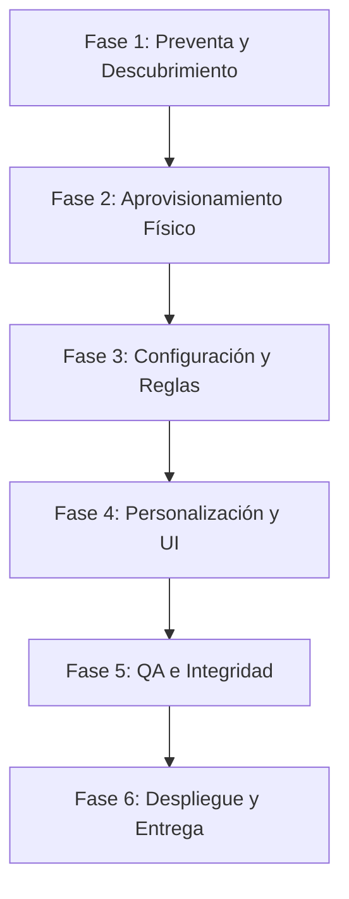

# 🗺️ Flujo Maestro de Operación: De la Preventa a la Entrega del Cliente

Esta guía unifica el ciclo completo de vida de un proyecto en el ecosistema **PROTOTIPE**, detallando cada paso operativo y técnico desde el primer contacto comercial con el cliente hasta el despliegue a producción y la entrega final de la aplicación.

---

## 📋 Resumen del Ciclo de Vida

---

## 🏛️ Desglose del Flujo de Trabajo Paso a Paso

### 🤝 Fase 1: Preventa, Levantamiento y Cotización (Preventa)
1.  **Entrevista de Descubrimiento (Briefing Studio):**
    *   Ingresa al Dashboard central, pestaña **Briefing Studio**.
    *   Completa el wizard de 20 preguntas junto al cliente para extraer su nicho comercial (de los 23 oficiales en `niches.json`), módulos necesarios, y paleta de branding.
    *   El asistente analizará la viabilidad contra la biblioteca de componentes existentes.
2.  **Cotización y Propuesta (Cotizador):**
    *   Exporta el diagnóstico del Briefing al **Cotizador**.
    *   Configura setup fee, cargos de suscripción mensual y comisiones.
    *   Genera el PDF formal de la propuesta comercial directamente en el dashboard y descárgalo para firma.

### 🔌 Fase 2: Creación de la Infraestructura en Firebase
Antes de ejecutar el script del CLI Bridge, debes preparar el entorno en la nube del cliente:
1.  Ingresa a la consola de Firebase del cliente y crea un nuevo proyecto (ej: `ventas-mi-cliente`).
2.  Habilita **Firebase Authentication** (Correo/Contraseña y Teléfono).
3.  Habilita **Cloud Firestore** en modo producción y elige la región del servidor.
4.  Habilita **Firebase Hosting**.

### ⚙️ Fase 3: Aprovisionamiento Automatizado (CLI Bridge)
1.  **Importación al Onboarding Wizard:**
    *   En el Dashboard central, haz clic en "Importar a Aprovisionamiento" desde el Cotizador.
    *   Verifica los campos de variables de entorno, credenciales del administrador inicial, WhatsApp de contacto y puerto Vite asignado.
2.  **Ejecución del Generador:**
    *   Al enviar el formulario, el Dashboard se comunicará con el backend `Prototipe-CLI/server.js` (puerto 3001).
    *   El Bridge clonará la plantilla base (`Plantillas Core/App Ventas`), creará la carpeta física en `Instancias Clientes/[nombre-cliente]`, inyectará la paleta de colores HSL en `index.html`/CSS, renombrará assets, generará el manifest.json de la PWA y configurará los servicios.

### 🗄️ Fase 4: Sembrado, Reglas de Base de Datos e Integración Local
1.  **Siembra de Datos de Prueba (Seeding):**
    *   Ingresa a la carpeta del nuevo cliente y ejecuta el script de siembra local `npm run db:seed`. Esto poblará Firestore con catálogos base, productos de demostración del nicho y perfiles iniciales de personal.
2.  **Blindaje de Reglas de Seguridad:**
    *   Configura las reglas locales en `firestore.rules`.
    *   Agrega los índices compuestos necesarios para las consultas en `firestore.indexes.json`.
    *   Sube las reglas a producción: `cmd /c firebase deploy --only firestore`.

### 🎨 Fase 5: Personalización Visual e Inyección de Componentes
1.  **Portabilidad de Módulos Específicos:**
    *   Si el cliente requiere vistas adicionales, usa la CLI o la directiva `@portar-componente` para extraer componentes del catálogo global a la carpeta local del cliente.
2.  **Verificación de Calidad y Estilos:**
    *   Asegura el contraste AAA (mínimo 7:1) usando la clase `!text-white` en botones con variables de fondo HSL.
    *   Verifica responsividad móvil (apilamiento vertical, tablas con scroll horizontal scrollbar-thin, prevención de desbordamientos con `truncate`).

### 🚀 Fase 6: QA, Compilación y Despliegue Final
1.  **Pruebas de Integridad:**
    *   Ejecuta las pruebas Playwright correspondientes en el entorno de testing.
    *   Corre la compilación local para validar la ausencia de warnings/errores de React: `npm run build`.
2.  **Despliegue a Producción:**
    *   Ejecuta el despliegue del Hosting: `cmd /c firebase deploy --only hosting`.
3.  **Entrega y Alta en CRM:**
    *   Descarga y entrega los códigos QR de acceso rápido.
    *   Registra formalmente al cliente en `clientes_control` de Firestore central para activar la telemetría e inicio automático de monitoreo de comisiones del desarrollador.
