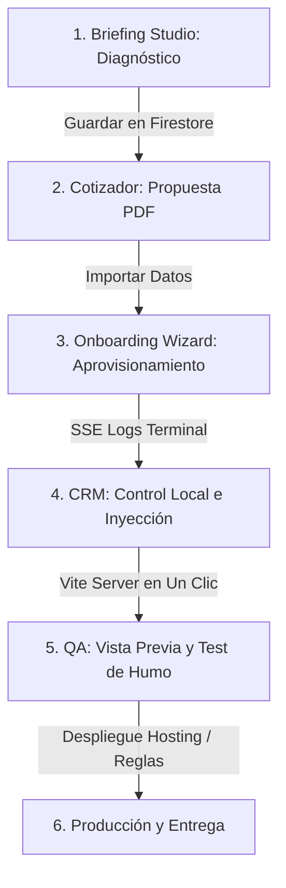

# 🗺️ Flujo Maestro de Operación: Ciclo de Vida Automatizado del Cliente

Esta guía establece el mapa de ruta definitivo y **100% verificado** para gestionar el ciclo de vida de un cliente en **PROTOTIPE**. A diferencia del desarrollo manual tradicional, todo el flujo de preventa, aprovisionamiento, pruebas y despliegue se gestiona de forma centralizada y automatizada a través del **Dashboard de Desarrollo (dev-dashboard)** y el **Bridge CLI**.

---

## 📋 Resumen del Flujo en la Consola Central

---

## 🏛️ Desglose del Flujo de Trabajo Real

### 🤝 1. Descubrimiento y Diagnóstico (Briefing Studio)
El proceso inicia en la pestaña **Briefing Studio** del Dashboard Central:
*   **Wizard de 20 Pasos:** Se realiza una sesión de preventa interactiva con el cliente recopilando su modelo de negocio, dolores, metas de escalabilidad y branding básico.
*   **Auditoría Automática:** El sistema evalúa las respuestas contra el catálogo físico de la biblioteca de componentes y calcula un puntaje de complejidad.
*   **Guardado y Exportación:** La sesión se almacena en la colección `briefings` de Firestore y se exporta como plantilla de levantamiento Markdown (.md) al monorepo.

### 💰 2. Propuesta Comercial (Cotizador)
*   **Importación:** El desarrollador importa los datos de complejidad de la sesión de Briefing a la pestaña **Cotizador**.
*   **Simulación de Costos:** Se calcula la propuesta económica (setup fee, mensualidad, comisión de telemetría) usando la matriz de precios oficial.
*   **Entrega del Contrato:** Se genera y descarga la propuesta formal en PDF para la firma del cliente.

### 🚀 3. Aprovisionamiento Automatizado (Onboarding Wizard)
Desde el Cotizador, se hace clic en **"Importar a Aprovisionamiento"**, redirigiendo al desarrollador a la pestaña **Nuevo Cliente**:
1.  **Formulario del Wizard (Tres Secciones):**
    *   **Servidor:** Nombre del cliente, ID/slug normalizado, y modelo de facturación.
        *   *Opción Automática (autoProvisionFirebase):* El CLI crea automáticamente el proyecto Firebase en la nube.
        *   *Opción Manual:* El desarrollador introduce las llaves del proyecto creado previamente en la consola de Firebase.
    *   **Branding:** Selección de tipografías y HSL de marca blanca. El botón **"Generar Paleta AAA"** calcula iterativamente contrastes que cumplan con la norma WCAG 2.1 (relación >= 7:1) para garantizar legibilidad del color de fondo vs. texto en botones.
    *   **Módulos:** Activación/desactivación de características (Caja POS, domicilios, KDS, DIAN) e inyección de componentes atómicos.
2.  **Ejecución y SSE Terminal:**
    *   Al hacer clic en **"Crear Proyecto"**, se envía el payload al Express Bridge (`/api/create-project`).
    *   El Bridge levanta un proceso hijo (`worker_create_project.js`) que clona la plantilla core base, inyecta la paleta HSL en index.css/CSS global, genera los 12 archivos estándar de documentación local (`contexto_negocio.md`, `restricciones_tecnicas.md`, etc.) y escribe los archivos de configuración.
    *   Los logs detallados de la clonación se transmiten en tiempo real mediante un **Stream SSE (`/api/create-project/stream`**), mostrándose en la consola interactiva del Dashboard.

### 🛠️ 4. Control Local e Integración (CRM Clientes)
Una vez aprovisionado, el cliente aparece en la pestaña **CRM Clientes**. Toda la operación de desarrollo se realiza desde su panel expandido en un solo clic:
*   **Levantar Servidor Local:** El botón "Iniciar Servidor" llama a `/api/project/dev/start`. Levanta una instancia Vite en un puerto dinámico y expone el enlace **"Abrir Vista Previa"** para interactuar con la app del cliente en caliente.
*   **Administración de Base de Datos:**
    *   Se ejecuta el sembrado de datos demo para el nicho seleccionado (`/api/project/db/seed`).
    *   Se compilan y sincronizan las reglas de seguridad físicas y los índices compuestos directamente en Firebase (`/api/project/firebase-rules/deploy`).

### 🧩 5. Personalización y Auditoría de Drift
*   **Inyección de Componentes:** Si el cliente requiere características especializadas de la biblioteca, se inyectan en caliente desde la interfaz del CRM mediante el endpoint `/api/library/inject`.
*   **Detector de Desviación (Drift):** El Dashboard ejecuta auditorías de paridad física contra el Core para detectar modificaciones o archivos desalineados, permitiendo sincronizarlos en lote (`/api/project/sync-files`) o descartar cambios locales en Git (`/api/git/discard`).

### 📦 6. Despliegue y Entrega de la Instancia
*   **Tests de Humo E2E:** Ejecución de pruebas de carga y simulación de flujos usando Playwright (integrado en la pestaña **Tests E2E** del Dashboard).
*   **Despliegue a Producción:** Desde el CRM del Dashboard, se ejecuta el build final de producción y el deploy al Firebase Hosting del cliente en un solo clic.
*   **Activación de Telemetría:** Se descarga el set de códigos QR de compra rápida o credenciales del administrador, y se activa el monitoreo de comisiones del desarrollador en el CRM central.
