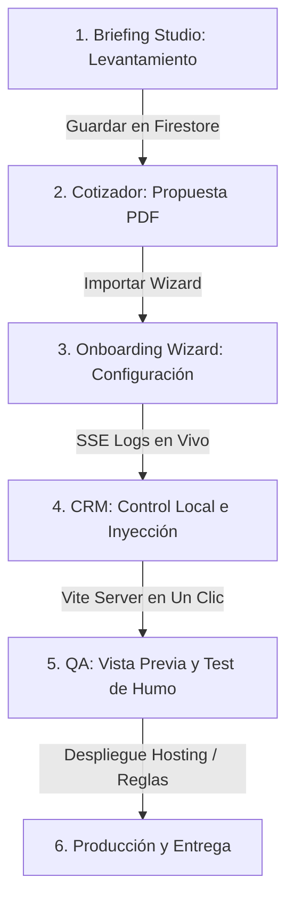

# 🗺️ Flujo Maestro de Operación: Ciclo de Vida Automatizado y Desglose del Aprovisionador

Esta guía establece el mapa de ruta definitivo y **100% verificado** para gestionar el ciclo de vida de un cliente en el ecosistema **PROTOTIPE**. Todo el flujo se coordina desde el **Dashboard de Desarrollo (dev-dashboard)** y el **Bridge CLI** local.

---

## 📋 Resumen del Ciclo de Vida Operativo

---

## 🏛️ Desglose del Flujo de Trabajo Real Paso a Paso

### 🤝 Fase 1: Levantamiento y Preventa (Briefing Studio)
1.  **Entrevista Interactiva:** En la pestaña **Briefing Studio**, el desarrollador completa un wizard de 20 secciones junto al cliente, recopilando:
    *   Información general y canales de venta actuales.
    *   Dolores operativos (tiempos de caja, desfase de stock, merma).
    *   Requerimientos obligatorios y deseables.
    *   Branding corporativo preliminar.
2.  **Análisis de Viabilidad (Modo 2):** El CLI compara los requerimientos del cliente contra el catálogo real de la biblioteca de componentes y sugiere módulos Core a habilitar.
3.  **Guardado:** La sesión se persiste en Firestore (`briefings`) y se exporta como documento Markdown en el monorepo.

### 💰 Fase 2: Simulación Financiera (Cotizador)
1.  **Importación Directa:** Se cargan los datos de complejidad de la sesión del Briefing en el **Cotizador**.
2.  **Configuración de Tarifas:** El desarrollador ajusta:
    *   Setup fee inicial.
    *   Mensualidades fijas y comisiones por telemetría.
3.  **Propuesta PDF:** El sistema genera y descarga una propuesta formal firmable.

---

### 🚀 Fase 3: Aprovisionamiento y Configuración (Onboarding Wizard)
El desarrollador presiona **"Importar a Aprovisionamiento"** desde el Cotizador, cargando todos los parámetros en el wizard de **Nuevo Cliente**.

#### 📁 Pestaña 1: SERVIDOR
*   **Nombre del Cliente:** Nombre comercial del negocio (Ej. *Ventas SmartFix*).
*   **ID de Cliente:** Identificador único normalizado de solo caracteres alfanuméricos y guiones (Ej. *ventas-smartfix*), autogenerado en base al nombre.
*   **Modelo de Facturación:** CustomSelect para elegir:
    *   *Porcentaje de Venta:* Se habilita el campo **Tasa de Comisión (%)**.
    *   *Monto Fijo por Servicio:* Se habilita el campo **Monto Fijo por Servicio ($ COP)**.
    *   *Mensualidad Fija:* Se habilita el campo **Pago Mensual Fijo ($ COP)**.
*   **Costo de Setup Inicial ($ COP):** Cobro único de puesta en marcha.
*   **Token de Telemetría:** Clave única auto-generada para reportar telemetría en vivo a la base central de comisiones.
*   **Ruta Física en Disco:** Ubicación de la carpeta de la instancia (Ej. `D:\PROTOTIPE\Instancias Clientes\App-[id]`).
*   **Email y Contraseña del Administrador:** Cuenta inicial de acceso admin para poblar Firestore Auth. Si se deja en blanco, la contraseña se auto-genera de forma segura.
*   **Puerto Local de Vite:** Puerto libre dinámico para levantar la instancia local sin colisionar con otros clientes (Ej. *5174*).
*   **Plantilla Base:** Core fuente a clonar (Ej. `template-core-seed` o `template-ventas`).
*   **Aprovisionar Firebase Automáticamente (Toggle):**
    *   *Activado (autoProvisionFirebase):* El Bridge CLI crea de forma desatendida el proyecto, la base de datos Firestore y registra la Web App en la nube del cliente.
    *   *Desactivado:* Habilita campos obligatorios manuales: **Firebase API Key, Auth Domain, Project ID, Storage Bucket, App ID y VAPID Key**.

#### 🎨 Pestaña 2: BRANDING
*   **Generador Inteligente AAA (Botón):** Ejecuta `handleGenerateAAAContrast`, aplicando cálculos matemáticos iterativos de luminancia según la norma WCAG 2.1 para garantizar una relación de contraste mínima de `7.0:1` entre los textos e iconos y los colores primarios.
*   **Explorar Paletas de Nicho (Botón):** Abre un modal para seleccionar combinaciones curadas preestablecidas para los 23 nichos comerciales oficiales.
*   **Logo Corporativo de Marca:** Selector para subir imágenes (SVG, PNG, JPG) que se auto-optimizan a 512px para el favicon de la PWA, o bien ingresar la **Ruta Absoluta del Archivo** en el disco local.
*   **Canales de Soporte y Datos:**
    *   **WhatsApp del Negocio:** Número de contacto comercial.
    *   **Dirección de la Sucursal:** Dirección para retiro físico en tienda.
*   **Paleta de Colores Básica:** Selectores de color nativos para:
    *   *Color Primario* (`--color-primary`)
    *   *Color Secundario* (`--color-accent`)
    *   *Color de Fondo* (`--color-bg`)
    *   *Color de Texto* (`--color-text`)
*   **Personalización Avanzada de Colores (Tokens HSL):**
    *   *Color de Superficie* (`--color-surface`): Color de tarjetas y modales.
    *   *Superficie Secundario* (`--color-surface-2`): Color de fondos alternos.
    *   *Bordes e Hilos* (`--color-border`): Líneas de separación sutiles.
    *   *Texto Atenuado* (`--color-text-muted`): Color de subtítulos y textos secundarios.
*   **Estilos y Lienzo (Design Effects Studio):**
    *   **Lienzo & Fondos (bgType):**
        *   `solid`: Fondo liso clásico.
        *   `mesh`: Orbes flotantes animados con desenfoque radial. Habilita: **Número de Esferas (2 a 6)** y **Opacidad de Esferas**.
        *   `aurora`: Degradados fluidos que simulan una aurora boreal.
        *   `grid`: Malla en perspectiva 3D tecnológica.
        *   `particles`: Partículas interactivas aceleradas por GPU. Habilita: **Cantidad (10 a 150), Velocidad, Tamaño Máximo (1 a 100px), Opacidad, Dirección de Flujo (Aleatorio, Subir, Bajar, Izquierda, Derecha), y Tipo/Forma (Círculo, Glow, Chispas, o Icono del Nicho)**. Si se elige *Icono del Nicho*, se expone un buscador interactivo para seleccionar entre **más de 100 iconos vectoriales** organizados por categorías funcionales.
    *   **Spotlight (Toggle):** Iluminación radial dinámica que sigue la posición física del cursor del ratón.
    *   **Estilo de Sombra (shadowStyle):** `none` (plano), `soft` (profundidad suave), `hard` (neobrutalismo), `glow` (resplandor de marca) y `neon` (neon multicapa).
    *   **Border Radius (radiusMode):** `sharp` (0px), `soft` (6px), `rounded` (12px), `extra` (20px) o `pill` (redondeado total/cápsula).
    *   **Efectos Premium de Bordes:**
        *   *Borde Láser XOR (borderBeam):* Línea de luz que recorre perimetralmente el borde del elemento.
        *   *Efecto 3D Tilt (tilt3d):* Rotación interactiva en el espacio 3D según el ángulo del cursor.
        *   *Vidrio Esmerilado (glassmorphism):* Contenedores translúcidos con desenfoque de fondo.
    *   **Velocidad de Animaciones (animationSpeed):** `instant` (0ms), `fast` (150ms), `normal` (250ms), o `slow` (400ms).
*   **Google Font:** Selector modal de fuentes con buscador y previsualizador tipográfico.

#### 🛠️ Pestaña 3: MÓDULOS
*   **Nicho de Mercado / Vertical de Negocio:** Selector CustomSelect que consume `niches.json` con las 23 verticales comerciales oficiales.
*   **Funcionalidades Core (Checkboxes):**
    *   *Inicializar repositorio en GitHub:* Crea el repo y sube el código inicial.
    *   *Desplegar reglas e índices en Firebase:* Sube reglas físicas y esquemas de índices.
    *   *Activar PWA:* Habilita el soporte offline y prompt de instalación en smartphones.
    *   *Notificaciones Push:* Habilita suscripciones Firebase Cloud Messaging.
    *   *Módulo de Domicilios y Despachos:* Lógica de reparto y cálculo de fletes.
    *   *Pantalla de Cocina / KDS:* Tableros de preparación de órdenes.
    *   *Módulo de Facturación Electrónica:*
        *   Si está activo, habilita la opción **Facturación Electrónica DIAN Directa** y el control numérico del **Costo por Factura DIAN ($ COP)**.
*   **Recomendaciones de Biblioteca y Módulos:** Buscador de componentes interactivos indexado por keywords de negocio (ej. *agenda, rifa, caja, scanner*). Al marcar un componente, este se añade al payload para su auto-inyección en la carpeta de destino.

Al hacer clic en **"Crear Proyecto"**, el Dashboard inicia la llamada al Bridge CLI, el cual procesa los archivos en segundo plano y transmite las salidas en vivo a la terminal de logs del programador mediante una conexión **SSE (`/api/create-project/stream`**).

---

### 🛠️ Fase 4: Operación Local y Sincronización (CRM Clientes)
Creada la carpeta del cliente en `Instancias Clientes/`, todas las acciones de codificación y base de datos se controlan desde la pestaña **CRM Clientes**:
1.  **Arranque del Servidor local:** Presionando **"Iniciar Servidor"**, la consola levanta el proceso Vite de la instancia (`/api/project/dev/start`) y provee el link **"Abrir Vista Previa"** para probar la aplicación.
2.  **Poblar Base de Datos (Seeding):** Desde la interfaz, se dispara el sembrado (`/api/project/db/seed`) poblando Firestore con los datos iniciales y productos demostración del nicho.
3.  **Actualizaciones Core (Drift Detector):** El Dashboard realiza una auditoría de paridad física contra el Core para detectar desviaciones en el código. El desarrollador puede inyectar los cambios de core en lote (`/api/project/sync-files`) o descartar modificaciones locales desalineadas (`/api/git/discard`).

### 🚀 Fase 5: Pruebas de Calidad y Despliegue de Producción
1.  **Tests E2E:** En la pestaña **Tests E2E**, se ejecutan simulaciones automatizadas headless con Playwright para validar flujos de cobro y registro.
2.  **Despliegue a Firebase:** Se ejecuta la compilación final y el despliegue al Hosting de producción de Firebase del cliente en un solo clic desde el CRM.
3.  **Entrega Final:** Se descarga el set de códigos QR de compra rápida o credenciales del administrador y se activa el monitoreo de comisiones del desarrollador en el CRM central.
