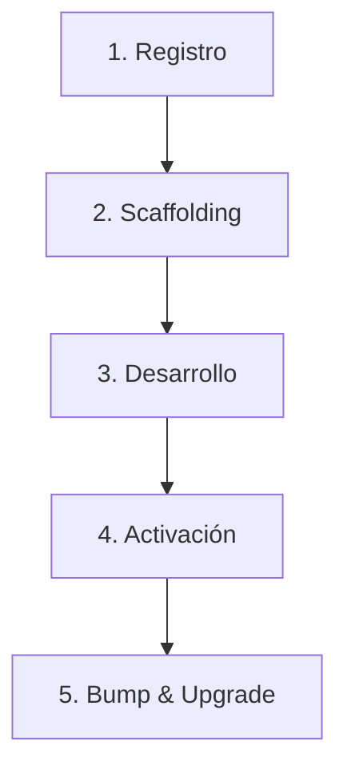

# 📖 Manual de Gestión de Cores y Plantillas de PROTOTIPE

Este manual describe la arquitectura, la estructura del monorepo y el ciclo de vida de los Cores (Plantillas Maestras) del ecosistema. Su propósito es proveer a desarrolladores y agentes de IA un marco conceptual claro para el registro, la personalización, la activación y la actualización de cores sin generar derivas de código (drifts).

---

## 🏗️ 1. Arquitectura y Estructura en el Monorepo

El ecosistema PROTOTIPE funciona bajo un monorepo administrado por el Bridge CLI local (Express en puerto `3001`). Los cores actúan como plantillas base sanitizadas a partir de las cuales se aprovisionan las instancias finales de clientes.

### Estructura de Directorios

```
D:/PROTOTIPE/
├── Plantillas Core/
│   ├── App Ventas/                  <-- Core fuente de comercio (Ventas, POS, eCommerce)
│   ├── App Servicios/               <-- Core fuente de servicios y agenda
│   └── App [NuevoCore]/             <-- Creado dinámicamente mediante el CLI
│       ├── package.json
│       ├── .prototipe.json
│       ├── firestore.rules
│       ├── src/                     <-- Código React de la aplicación
│       └── Documentacion App [NuevoCore]/ <-- 12 archivos estándar obligatorios
│
├── Prototipe-CLI/
│   ├── plantillas_registro.json     <-- Catálogo lógico centralizado de cores
│   ├── templates/
│   │   ├── template-ventas/         <-- Carpeta espejo sanitizada del core ventas
│   │   └── template-[clave]/        <-- Carpeta espejo sanitizada del nuevo core
│   └── server.js                    <-- Daemon del Bridge CLI
│
└── Instancias Clientes/
    └── ventas/
        └── ventas-moni-app/         <-- Instancia aprovisionada del cliente final
```

---

## 📝 2. El Registro Central (`plantillas_registro.json`)

El archivo `plantillas_registro.json` es la fuente de verdad lógica para catalogar qué plantillas existen, dónde están físicamente y si están activas para su uso.

```json
{
  "plantillas": {
    "ventas": {
      "coreType": "ventas",
      "fuente": "D:/PROTOTIPE/Plantillas Core/App Ventas",
      "destino": "D:/PROTOTIPE/Prototipe-CLI/templates/template-ventas",
      "nicho": "Retail / Ecommerce / POS",
      "activo": true,
      "version": "1.0.6"
    }
  }
}
```

---

## 🔄 3. Ciclo de Vida de un Core

El ciclo de vida de un core consta de 5 fases clave:



### Fase 1: Creación y Registro
Se realiza mediante un `POST` a `/api/register-core` enviando `{ nombre, clave, nicho }`. El sistema realiza las siguientes acciones:
1. Crea la carpeta `Plantillas Core/App [Nombre]`.
2. Genera los **12 documentos de gobernanza estándar** (`Documentacion App [Nombre]`) para proveer contexto comercial y técnico a las IAs.
3. Copia el archivo global de directivas `GEMINI.md` al nuevo core.
4. Genera configuraciones Firebase base (`firestore.rules`, `storage.rules`, `firestore.indexes.json`, `firebase.json`).
5. Crea una carpeta espejo vacía en `templates/template-[clave]`.
6. Añade el core a `plantillas_registro.json` con `"activo": false` y versión `"0.0.1"`.

### Fase 2: Scaffolding (Opcional)
Se ejecuta mediante un `POST` a `/api/cores/:clave/scaffold` enviando `{ baseCore }` (ej: `"ventas"` o `"core-seed"`). 
* Copia selectivamente directorios estructurales de React (`src/components`, `src/hooks`, `src/services`, `src/store`, `src/layouts`, `src/pages`, `src/routes`, `src/utils`, `src/constants`, `src/schemas`, `src/providers`, etc.).
* Renombra de forma recursiva los nombres de las carpetas bases y variables de código en texto plano al namespace del nuevo core (ej: reemplaza "App Ventas" por "App Facturacion").
* Ignora archivos sensibles locales (`.env.local`, `.firebaserc`, `dist`, `node_modules`).

### Fase 3: Desarrollo
El desarrollador o agente de IA codifica la aplicación del vertical de negocio de manera aislada dentro de `Plantillas Core/App [Nombre]`.

### Fase 4: Activación
Se ejecuta mediante un `POST` a `/api/cores/:clave/activate`.
* Copia y sincroniza el código físico final desde la carpeta fuente `Plantillas Core/App [Nombre]` hacia `templates/template-[clave]`, sanitizando credenciales y entornos.
* Incrementa la versión SemVer patch del core en `plantillas_registro.json` y en su `package.json` fuente.
* Cambia el estado a `"activo": true` en el catálogo central para habilitarlo en el Wizard de aprovisionamiento de nuevos clientes.

### Fase 5: Upgrades y Sincronizaciones
Al corregir bugs o añadir features en la plantilla core fuente:
* **Bump Version (`POST /api/cores/:clave/bump-version`):** Incrementa la versión patch en disco, actualiza el `package.json` de la fuente y resincroniza los archivos al CLI.
* **Sync (`POST /api/cores/:clave/sync`):** Sincroniza archivos en caliente sin incrementar versión ni alterar el estado.

---

## ⚡ 4. Endpoints del Bridge CLI (`server.js`)

| Método | Endpoint | Propósito |
|---|---|---|
| `POST` | `/api/register-core` | Registra e inicializa un nuevo Core con 12 docs estándar |
| `GET` | `/api/cores` | Obtiene el listado lógico de todos los Cores registrados |
| `GET` | `/api/cores/metadata` | Carga y consolida los manifiestos `core-manifest.json` |
| `POST` | `/api/cores/:clave/scaffold` | Copia la estructura React de un Core base renombrando referencias |
| `POST` | `/api/cores/:clave/activate` | Sincroniza código al CLI y marca el Core como activo (`activo: true`) |
| `POST` | `/api/cores/:clave/bump-version` | Incrementa versión SemVer patch del Core y sincroniza archivos |
| `POST` | `/api/cores/:clave/sync` | Resincroniza archivos en caliente del Core fuente al espejo CLI |

### 🚀 Pipeline de Promoción y Migración (Fase 6)
Para promover una instancia de cliente a una plantilla Core genérica o migrar linajes entre clientes de forma transaccional, consulta el [Manual de Promoción de Instancias Clientes a Plantillas Core](file:///D:/PROTOTIPE/Documentacion%20PROTOTIPE/07_Manuales_Desarrollo/Arquitectura_Multi_Instancia/Prototipe_CLI/manual_promocion_clientes_a_cores.md) que documenta detalladamente los 11 endpoints del pipeline, validadores de secretos/PII, compilar preflight, SSE streams, y rollbacks.

---

## 🧠 5. Guía de Resolución Dinámica para IAs

Para evitar tener mapeos estáticos en el código que requieran mantenimiento manual, la IA debe utilizar siempre el **resolvedor dinámico** implementado en `VersionManager.js`:

```javascript
  static getCorePathForClient(clientPath) {
    // Escanea físicamente el directorio "Plantillas Core" y busca por coincidencia difusa
    // para mapear el identificador del core de la instancia con su carpeta real en disco.
  }
```

### Reglas Críticas al Modificar o Crear Cores:
1. **No mezclar entornos:** Nunca expongas credenciales de desarrollo (`.env`, `serviceAccountKey.json`) al directorio `templates/` o repositorios.
2. **Sincronización:** Cada vez que edites el código de un Core en `Plantillas Core/`, recuerda activar la sincronización hacia `templates/` para que los clientes puedan recibir la actualización en sus preflights.
3. **Consistencia de Versión:** La versión real que corre una instancia cliente se lee de su `package.json` físico de manera prioritaria sobre el lockfile, auto-alineando este último en caliente si difieren.

---

## 🔒 6. Manifiesto de Overrides (Personalizaciones Intencionales del Cliente)

**Estado:** `ACTIVO` — implementado 2026-07-16 (Fase A de la
`Documentacion PROTOTIPE/00_Continuidad/canonical/propuesta_arquitectura_git_2026-07-16.md`).

### 6.1 El problema que resuelve

Antes de esta implementación, el sincronizador y el detector de drift
comparaban **ciegamente** cada archivo del Core contra el mismo archivo en
el cliente por hash MD5. Si diferían, el archivo se marcaba como
"desviación" (`drift`) y el sincronizador lo **sobreescribía** en el
siguiente `sync`. Esto no distinguía entre dos casos muy distintos:

- El cliente simplemente no se ha sincronizado todavía (drift real, se
  debe corregir).
- El cliente tiene una **personalización intencional** en ese archivo
  (una decisión de negocio o técnica válida) que **nunca debería
  sobreescribirse**.

Este hallazgo (`R-024`) se confirmó formalmente en la auditoría de Fase 3
del roadmap técnico (`CORE-370`, 2026-07-16).

### 6.2 Cómo declarar un override (uso práctico)

Cada cliente tiene su propio archivo `.prototipe.json` en la raíz de su
proyecto (ej. `Instancias Clientes/ventas/ventas-moni-app/.prototipe.json`).
Para declarar que un archivo es una personalización intencional de ESE
cliente, agrega su ruta (relativa a la raíz del proyecto del cliente, con
`/` como separador) al array `overrides`:

```json
{
  "clientId": "ventas-moni-app",
  "projectName": "ventas-moni-app",
  "template": "ventas",
  "coreType": "ventas",
  "niche": "retail",
  "version": "1.0.6",
  "createdAt": "2026-06-19T22:31:25.897Z",
  "overrides": [
    "src/index.css",
    "src/features/credits/services/creditService.js"
  ]
}
```

Cualquier archivo listado ahí:
- **Nunca** se marcará como "desviación" en el detector de drift.
- **Nunca** se sobreescribirá en un sync/deploy de ese cliente.
- No afecta a NINGÚN otro cliente — el manifiesto es por cliente, no
  global.

Si el archivo no existe en `.prototipe.json` todavía o el campo
`overrides` no está presente, se asume una lista vacía (comportamiento
idéntico al que existía antes de esta implementación — retrocompatible,
ningún cliente existente se ve afectado a menos que se le agregue el
campo explícitamente).

### 6.3 Dónde vive el código (para no perderle la pista)

Todo en `Prototipe-CLI/server.js`:

| Función/endpoint | Línea aprox. | Qué hace con `overrides` |
|---|---|---|
| `validatePrototipeMetadata()` | ~194 | Garantiza que `meta.overrides` sea siempre un array (default `[]` si falta) |
| `GET /api/project/drift` | ~8937 | Filtra `coreFiles` para excluir rutas en `overrides` **antes** de calcular `differences`/`parityPercent`. Expone el campo `overridesApplied` en la respuesta para que la UI pueda mostrarlo. |
| `GET /api/instancias/list` (cálculo de `driftCount` por cliente, usado en el badge de `CoreSyncPanel.jsx`) | ~11406 | Salta los archivos en `overrides` al contar `driftCount` |
| `GET /api/instancias/sync-and-deploy-stream` (sincronización real, batch) | ~12107 | Lee `overrides` del `.prototipe.json` del cliente y los excluye de `coreFiles` antes de calcular `changes` — esos archivos nunca se copian ni se sobreescriben. Registra en el log de sync cuántos archivos se saltaron por override. |

### 6.4 Verificación realizada (evidencia real, no teórica)

Probado en vivo contra Moni (`ventas-moni-app`), usando `src/pages/LoginPage.jsx`
(que hoy difiere de verdad entre Core y Moni) como caso de prueba:

```
ANTES de declarar el override:
  LoginPage.jsx en differences: true
  overridesApplied: []
  total differences: 73

DESPUÉS de declarar "src/pages/LoginPage.jsx" en overrides:
  LoginPage.jsx en differences: false
  overridesApplied: ["src/pages/LoginPage.jsx"]
  total differences: 72

Badge de CoreSyncPanel (driftCount vía /api/instancias/list): 72 (coincide)
```

El override de prueba se **revirtió** después de la verificación (ese
archivo difiere hoy porque un fix de bug no se ha propagado a Core
todavía, no porque sea una personalización de negocio real — dejarlo
marcado como override lo habría ocultado para siempre de futuras
sincronizaciones, que es exactamente lo que no se quiere en ese caso).

### 6.5 Lo que esta Fase A **no** incluye todavía (alcance explícito)

- **No hay UI en el Dashboard** para declarar/quitar overrides — hoy se
  edita `.prototipe.json` a mano. Un panel dedicado (quizás dentro de
  `ClientLifecyclePanel.jsx`) queda como mejora futura, no bloqueante.
- **No se probó contra un sync/deploy real completo** (solo contra los
  endpoints de solo-lectura de drift) — la lógica del endpoint de sync es
  idéntica en estructura (mismo patrón de filtrado), pero un test end-to-end
  de un deploy real con overrides queda pendiente de la primera vez que se
  use en producción.
- **No reemplaza** el mecanismo estático `isPathExcludedFromSync()`
  (archivos como `.env.local`, `firebase.json`, credenciales) — ambos
  mecanismos coexisten: el estático protege archivos que NUNCA deben
  sincronizarse para ningún cliente; el manifiesto de overrides protege
  archivos que un cliente **específico** decidió personalizar.
- Esta es la **Fase A** de un plan de 5 fases — ver
  `propuesta_arquitectura_git_2026-07-16.md` para las Fases B-E (copia
  atómica, respaldo automatizado vía CI, reconciliador completo, limpieza
  de código huérfano de git).
