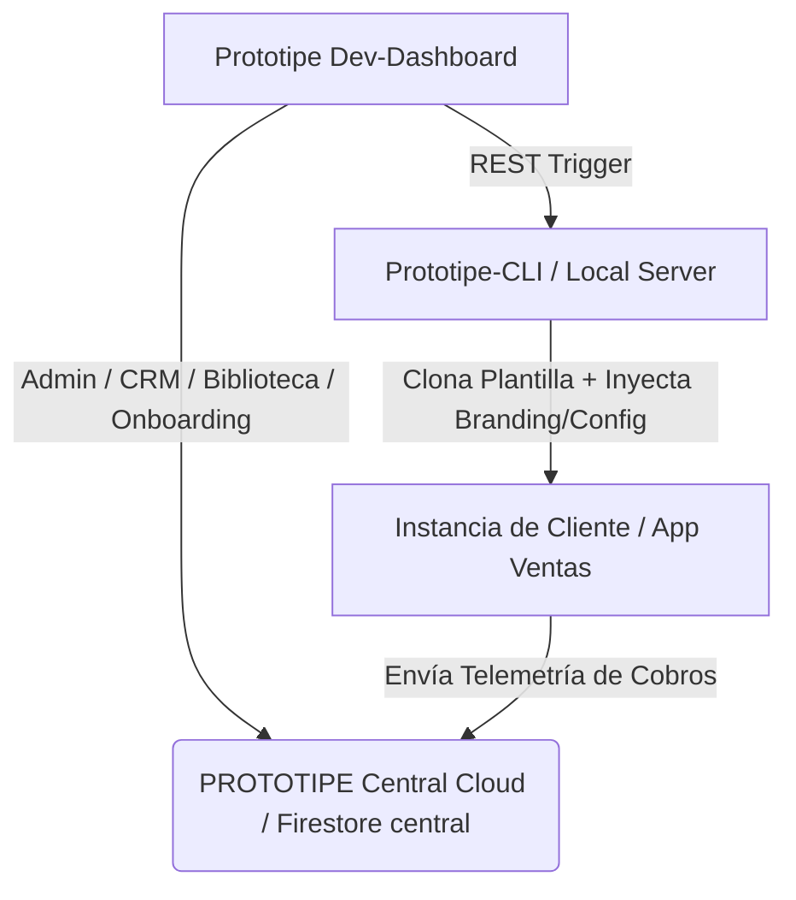

# 📋 Resumen Ejecutivo y Briefing del Proyecto: PROTOTIPE
Este documento proporciona un mapa contextual completo de **PROTOTIPE** para que un analista de IA o consultor técnico comprenda la visión, el alcance del negocio, la arquitectura física y lógica, y los flujos de automatización para formular propuestas de optimización.

---

## 🎯 1. Filosofía de Negocio: Marca Blanca a la Medida
**PROTOTIPE** no es un Ecosistema multi-tenant rígido y centralizado. Es un **motor de generación y aprovisionamiento de aplicaciones web marca blanca a la medida** diseñado para micro y medianas empresas en Latinoamérica.

*   **Instancias de Cliente Aisladas:** Cada cliente recibe su propia base de código reactiva (clonada de una plantilla base), su propio hosting en Firebase y su propio subdominio/dominio.
*   **Identidad Visual Inyectable (HSL):** El sistema de diseño se basa en tokens HSL configurables en `index.css`. Durante la inicialización, se sobrescriben los colores primarios, secundarios, fondos, textos y tipografías de Google Fonts directamente, adaptando la app a la marca en segundos sin reescribir CSS.
*   **Agnosticismo de Verticales (Nichos):** El core no asume campos rígidos de retail (como "Talla" o "Color"). Consume un objeto dinámico `atributos` en el catálogo y los carritos, permitiendo que la misma plantilla sirva para una tienda de ropa (`retail_clothing`), una tornería (`technical_services`), un taller de refrigeración (`refrigeration_ac`), etc.

---

## 🛠️ 2. Arquitectura Tecnológica del Ecosistema

El ecosistema se divide en tres piezas principales:



### 2.1 — Consola Central (`dev-dashboard`)
Una aplicación React/Vite ubicada en `D:\PROTOTIPE\Central PROTOTIPE\dev-dashboard` que actúa como centro de control para el desarrollador.
*   **CRM y Gestión Directa:** Permite registrar clientes, configurar su modelo comisional, visualizar el histórico de cobros y deudas, y editar en caliente su vertical o parámetros de cobro en Firestore.
*   **Asistente de Aprovisionamiento (Onboarding Wizard):** Formulario visual multipaso que auto-detecta credenciales de Firebase, configura branding en tiempo real con previsualización móvil interactiva, selecciona feature flags y despacha el aprovisionamiento al CLI.
*   **Biblioteca y Sandbox de Componentes:** Módulo que renderiza un visor del catálogo técnico (`06_Biblioteca_Componentes`) y un orquestador Sandbox que levanta mediante *lazy loading* (carga perezosa con `React.lazy` + `Suspense`) playgrounds interactivos con controles en caliente de 40 componentes modulares portables.

### 2.2 — Generador de Entornos (`Prototipe-CLI`)
Servicio Node.js local y CLI interactivo ubicado en `D:\PROTOTIPE\Prototipe-CLI`.
*   **`server.js` (Bridge REST):** Expone endpoints como `POST /api/create-project` para recibir payloads del dashboard central, y `GET /api/firebase-config` para auto-detectar las variables locales.
*   **`generator.js` (Orquestador de Código):** Realiza la clonación física del repositorio semilla (`template-core-seed` o plantillas preconfiguradas), genera los archivos `.env.local` y `.firebaserc`, inyecta la configuración del nicho (`niche.json`) y el branding (colores HSL y metadatos SEO en `index.html`), ejecuta la instalación de dependencias `npm install` y construye el build de producción para desplegar automáticamente a Firebase Hosting.

### 2.3 — Plantilla Semilla / App Activa (`App Ventas`)
El core de la aplicación de ventas y POS ubicado en `D:\Aplicaciones\App Ventas`.
*   **Frontend Stack:** React 19 + Tailwind CSS v4 + Zustand v5.
*   **Servicio de Base de Datos:** Firebase v12 (Firestore, Authentication, Storage, Cloud Messaging para notificaciones push PWA).
*   **Lógica Contable y Transaccional:**
    *   *Transacciones Atómicas:* Control de stock concurrente y arqueos de caja (`CajaDiariaPOS`).
    *   *Créditos y Saldos:* Gestión de deudas de clientes ("fiado") con abonos parciales y alertas.
*   **Telemetría y Cobro Comisional:** Módulo obligatorio (`telemetryService.js`) que envía reportes de facturación (`reportesBilling`) al Firestore central. Las comisiones del desarrollador se liquidan según tres modos: comisión por porcentaje sobre ventas, monto fijo por servicio, o tarifa mensual plana. Adicionalmente, computa cobros adicionales si está habilitada la Facturación Electrónica DIAN Directa.

---

## 📂 3. Estructura de Documentación del Proyecto
Toda la documentación técnica del proyecto se almacena bajo el estándar de subcarpetas en `D:\PROTOTIPE\Documentacion PROTOTIPE\`:
*   `01_Control_Versiones/`: Convenciones de Git y control de ramificaciones.
*   `02_Tareas_Roadmap/`: Registro físico de tareas pendientes, roadmap y planeación de hitos (`tareas_pendientes.md`).
*   `03_Auditorias_y_Faro_Core/`: Bitácora técnica global de cambios (`bitacora_cambios.md`), registro de bugs resueltos (`registro_errores_bugs.md`) e informes de auditorías de rendimiento y seguridad.
*   `04_Estandares_y_Skills/`: Manifiesto de negocio a la medida, guías maestras de código, estándares de diseño premium, reglas de IA (`GEMINI.md`) y scripts de sincronización (`sync_rules.js`).
*   `06_Biblioteca_Componentes/`: Catálogo con las fichas técnicas markdown de los 40 componentes modulares marca blanca.
*   `07_Manuales_Desarrollo/`: Manuales de lógica (créditos, jsPDF, WhatsApp), sharding de Firebase y el manual técnico de nichos.
*   `08_Plan_Escalabilidad_Negocio/`: Planes futuros de crecimiento, repositorios recomendados e informes estratégicos.
*   `09_Modulos_Completos/`: Módulos completos listos para inyección en proyectos.

---

## 🌟 4. Esquemas Clave y Flujo de Datos

### 4.1 — Estructura del Objeto Atributos Dinámicos
En los productos del catálogo y en los elementos del carrito, las especificaciones de servicio se modelan dinámicamente evitando talla/color estáticos:
```json
{
  "id": "servicio-torneado-bronce",
  "nombre": "Mecanizado de Eje",
  "precio": 120000,
  "niche": "technical_services",
  "atributos": {
    "material": "Bronce SAE 64",
    "diametro": "2.5 pulgadas",
    "tipoRosca": "NPT 1/2",
    "tolerancia": "0.02 mm"
  }
}
```

### 4.2 — Liquidación de Cobros en Firestore Central (`reportesBilling`)
En la base de datos de administración central, los reportes se consolidan mensualmente por cliente bajo este esquema:
```json
{
  "clientId": "barberia-glamour",
  "periodo": "2026-06",
  "totalVentas": 4500000,
  "comisionValor": 112500,
  "estadoPago": "pendiente",
  "dianDocsCount": 45,
  "updatedAt": "Timestamp"
}
```

---

## 🚀 5. Oportunidades de Mejora y Roadmap Recomendado
Para un analista de IA, estas son las áreas críticas sugeridas para proponer optimizaciones y arquitectura futura:

1.  **Motor de Prompting de Briefing Avanzado:** Integrar un servicio de IA en `dev-dashboard` que tome los requerimientos del cliente en lenguaje natural, y genere de manera inteligente el set ideal de feature flags, la paleta de colores HSL óptima y los esquemas JSON de `atributos` para el nicho.
2.  **Fragmentación Multi-Shard Automatizada:** Crear scripts en el CLI que permitan aprovisionar y segmentar clientes automáticamente bajo diferentes shards de Firebase cuando un shard central se acerque al límite de conexiones simultáneas.
3.  **Auditoría de Inyecciones y Reglas de Seguridad:** Robustecer las directivas en `firestore.rules` de las instancias de clientes, garantizando que los usuarios solo puedan escribir o leer sus propios carritos y estados de órdenes.
4.  **Optimización de Bundle Size y Code Splitting:** Introducir técnicas en Vite para que las instancias de clientes no carguen los estilos o dependencias de nichos inactivos, reduciendo el bundle de producción a menos de 300KB.
