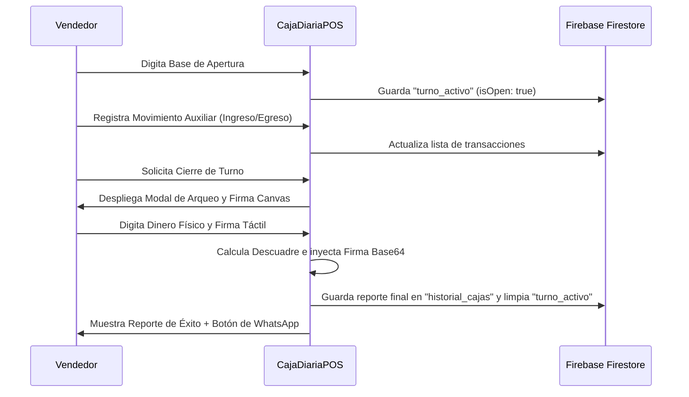

<!--
{
  "technicalName": "CajaDiariaPos",
  "targetPath": "src/components/modules/CajaDiariaPos.jsx",
  "dependencies": {
    "npm": {},
    "internal": []
  }
}
-->

# CajaDiariaPOS (Control de Caja y Cierre de Turno)

## 1. Propósito y Casos de Uso
El componente `CajaDiariaPOS` proporciona una interfaz premium de marca blanca para gestionar el flujo de efectivo diario de un punto de venta físico (POS). Resuelve la necesidad de abrir turnos con base inicial, registrar ingresos/egresos adicionales (como pagos de almuerzos o compras rápidas de insumos), y realizar arqueos de caja al final de la jornada con firma digital del responsable.

### Casos de Uso:
*   **Apertura de Turno:** Registro del efectivo inicial en caja (base).
*   **Control de Movimientos:** Auditoría rápida de ingresos y egresos extraordinarios de efectivo.
*   **Cierre y Conciliación:** Comparación matemática del saldo en sistema contra el saldo físico contado, exponiendo descuadres en tiempo real con colores HSL.
*   **Firma de Conformidad:** Lienzo interactivo en pantalla para firma digital del cajero/vendedor antes de guardar el reporte.

---

## 2. Especificación Visual y Estilos
*   **Colores de Marca:** Uso estricto de variables HSL del tema (`bg-[var(--color-bg)]`, `bg-[var(--color-surface)]`, `border-[var(--color-border)]`, etc.).
*   **Bordes e Iluminación:** Esquinas redondeadas grandes (`rounded-xl` / `rounded-2xl`) y sombras sutiles de resplandor para tarjetas activas.
*   **Lienzo de Firma:** Marco oscuro HSL para alta visibilidad y botón rápido de limpiar lienzo.
*   **Estados Semánticos (Descuadres):**
    *   *Diferencia = 0:* Badge y bordes verdes (`text-emerald-500`, `bg-emerald-500/10`) representando caja cuadrada.
    *   *Diferencia < 0:* Badge y bordes rojos (`text-rose-500`, `bg-rose-500/10`) indicando faltante de dinero.
    *   *Diferencia > 0:* Badge y bordes amarillos/naranja (`text-amber-500`, `bg-amber-500/10`) indicando sobrante.

---

## 3. Props y API del Componente

| Prop | Tipo | Default | Descripción |
| :--- | :--- | :--- | :--- |
| `initialState` | `Object` | `null` | Estado inicial de caja recuperado de Firestore si ya hay un turno activo. |
| `onSaveSession` | `Function` | `null` | Callback que se dispara al guardar transacciones locales o iniciar turno. Retorna el payload de sesión de caja. |
| `onCloseShift` | `Function` | `null` | Callback que se dispara al finalizar y firmar el turno. Retorna el reporte de arqueo estructurado y la firma en Base64. |
| `currencySymbol` | `String` | `"$"` | Símbolo para visualización monetaria. |
| `userName` | `String` | `"Cajero"` | Nombre del usuario/empleado activo que abre el turno. |

---

## 4. Código React Completo y 100% Funcional

```jsx
import React, { useState, useRef, useEffect } from 'react';

export default function CajaDiariaPOS({
  initialState = null,
  onSaveSession = null,
  onCloseShift = null,
  currencySymbol = "$",
  userName = "Vendedor"
}) {
  // Estados principales del flujo
  const [isOpen, setIsOpen] = useState(false);
  const [montoApertura, setMontoApertura] = useState("");
  const [transacciones, setTransacciones] = useState([]);
  const [fechaApertura, setFechaApertura] = useState(null);
  
  // Estados para el Modal de Registro de Movimiento
  const [isTxModalOpen, setIsTxModalOpen] = useState(false);
  const [txTipo, setTxTipo] = useState("egreso"); // "ingreso" | "egreso"
  const [txMonto, setTxMonto] = useState("");
  const [txDesc, setTxDesc] = useState("");

  // Estados para el Arqueo y Cierre de Turno
  const [isCloseModalOpen, setIsCloseModalOpen] = useState(false);
  const [montoFisico, setMontoFisico] = useState("");
  const [cierreCompletado, setCierreCompletado] = useState(false);
  const [reporteCierre, setReporteCierre] = useState(null);

  // Referencias para el Canvas de Firma
  const canvasRef = useRef(null);
  const isDrawing = useRef(false);

  // Cargar estado inicial si existe
  useEffect(() => {
    if (initialState) {
      setIsOpen(initialState.isOpen);
      setFechaApertura(initialState.fechaApertura);
      setTransacciones(initialState.transacciones || []);
      setMontoApertura(initialState.montoApertura || 0);
    }
  }, [initialState]);

  // Cálculos matemáticos de la sesión de caja
  const totalIngresosAdicionales = transacciones
    .filter(t => t.tipo === "ingreso")
    .reduce((sum, t) => sum + Number(t.monto), 0);

  const totalEgresosAdicionales = transacciones
    .filter(t => t.tipo === "egreso")
    .reduce((sum, t) => sum + Number(t.monto), 0);

  const saldoEsperado = Number(montoApertura || 0) + totalIngresosAdicionales - totalEgresosAdicionales;

  // Formateador de moneda
  const formatCurrency = (val) => {
    return `${currencySymbol} ${Number(val).toLocaleString('es-CO', { minimumFractionDigits: 0 })}`;
  };

  // Manejo de apertura de turno
  const handleOpenShift = (e) => {
    e.preventDefault();
    if (!montoApertura || Number(montoApertura) < 0) return;

    const newFecha = new Date().toISOString();
    setFechaApertura(newFecha);
    setIsOpen(true);
    setTransacciones([]);

    if (onSaveSession) {
      onSaveSession({
        isOpen: true,
        montoApertura: Number(montoApertura),
        fechaApertura: newFecha,
        transacciones: []
      });
    }
  };

  // Agregar transacción auxiliar
  const handleAddTransaction = (e) => {
    e.preventDefault();
    if (!txMonto || Number(txMonto) <= 0 || !txDesc.trim()) return;

    const newTx = {
      id: Date.now().toString(),
      tipo: txTipo,
      monto: Number(txMonto),
      descripcion: txDesc.trim(),
      hora: new Date().toISOString()
    };

    const updatedTxs = [...transacciones, newTx];
    setTransacciones(updatedTxs);
    setIsTxModalOpen(false);

    // Resetear form
    setTxMonto("");
    setTxDesc("");

    if (onSaveSession) {
      onSaveSession({
        isOpen: true,
        montoApertura: Number(montoApertura),
        fechaApertura,
        transacciones: updatedTxs
      });
    }
  };

  // Dibujo en Canvas táctil/puntero
  const getCoordinates = (e) => {
    const canvas = canvasRef.current;
    if (!canvas) return { x: 0, y: 0 };
    const rect = canvas.getBoundingClientRect();
    
    // Soporte para touch events vs mouse events
    if (e.touches && e.touches[0]) {
      return {
        x: e.touches[0].clientX - rect.left,
        y: e.touches[0].clientY - rect.top
      };
    }
    return {
      x: e.clientX - rect.left,
      y: e.clientY - rect.top
    };
  };

  const startDrawing = (e) => {
    e.preventDefault();
    const canvas = canvasRef.current;
    if (!canvas) return;
    const ctx = canvas.getContext('2d');
    const coords = getCoordinates(e);

    ctx.beginPath();
    ctx.moveTo(coords.x, coords.y);
    isDrawing.current = true;
  };

  const draw = (e) => {
    if (!isDrawing.current) return;
    e.preventDefault();
    const canvas = canvasRef.current;
    if (!canvas) return;
    const ctx = canvas.getContext('2d');
    const coords = getCoordinates(e);

    ctx.lineTo(coords.x, coords.y);
    ctx.stroke();
  };

  const stopDrawing = () => {
    isDrawing.current = false;
  };

  const clearCanvas = () => {
    const canvas = canvasRef.current;
    if (!canvas) return;
    const ctx = canvas.getContext('2d');
    ctx.clearRect(0, 0, canvas.width, canvas.height);
  };

  // Inicializar pincel del Canvas
  useEffect(() => {
    if (isCloseModalOpen && canvasRef.current) {
      const canvas = canvasRef.current;
      const ctx = canvas.getContext('2d');
      ctx.strokeStyle = '#a78bfa'; // Color violeta HSL
      ctx.lineWidth = 2.5;
      ctx.lineCap = 'round';
      ctx.lineJoin = 'round';
    }
  }, [isCloseModalOpen]);

  // Completar Cierre de Caja
  const handleConfirmCloseShift = (e) => {
    e.preventDefault();
    if (!montoFisico || Number(montoFisico) < 0) return;

    // Obtener firma en Base64
    let firmaBase64 = "";
    if (canvasRef.current) {
      firmaBase64 = canvasRef.current.toDataURL('image/png');
    }

    const valorFisico = Number(montoFisico);
    const descuadreVal = valorFisico - saldoEsperado;

    const summary = {
      fechaApertura,
      fechaCierre: new Date().toISOString(),
      montoApertura: Number(montoApertura),
      ingresosAuxiliares: totalIngresosAdicionales,
      egresosAuxiliares: totalEgresosAdicionales,
      saldoEsperado,
      montoFisico: valorFisico,
      descuadre: descuadreVal,
      responsable: userName,
      firma: firmaBase64
    };

    setReporteCierre(summary);
    setCierreCompletado(true);
    setIsOpen(false);
    setIsCloseModalOpen(false);

    if (onCloseShift) {
      onCloseShift(summary);
    }
  };

  // Generar reporte formateado para WhatsApp
  const handleShareReport = () => {
    if (!reporteCierre) return;
    
    const statusText = reporteCierre.descuadre === 0 
      ? "✅ CAJA CUADRADA" 
      : reporteCierre.descuadre < 0 
        ? `⚠️ FALTANTE: ${formatCurrency(Math.abs(reporteCierre.descuadre))}` 
        : `⚠️ SOBRANTE: ${formatCurrency(reporteCierre.descuadre)}`;

    const text = `*CIERRE DE CAJA DIARIA*
----------------------------
👤 *Vendedor:* ${reporteCierre.responsable}
📅 *Apertura:* ${new Date(reporteCierre.fechaApertura).toLocaleString()}
📅 *Cierre:* ${new Date(reporteCierre.fechaCierre).toLocaleString()}
----------------------------
💰 *Base Inicial:* ${formatCurrency(reporteCierre.montoApertura)}
📥 *Ingresos Auxiliar:* ${formatCurrency(reporteCierre.ingresosAuxiliares)}
📤 *Egresos Auxiliar:* ${formatCurrency(reporteCierre.egresosAuxiliares)}
💵 *Dinero Esperado:* ${formatCurrency(reporteCierre.saldoEsperado)}
💵 *Dinero Físico:* ${formatCurrency(reporteCierre.montoFisico)}
----------------------------
📊 *Estado:* ${statusText}`;

    navigator.clipboard.writeText(text);
    alert("Reporte copiado al portapapeles. ¡Listo para compartir!");
  };

  return (
    <div className="w-full max-w-4xl mx-auto p-4 space-y-6">
      
      {/* 1. ESTADO CERRADO: FORMULARIO DE APERTURA */}
      {!isOpen && !cierreCompletado && (
        <div className="bg-[var(--color-surface)] border border-[var(--color-border)] rounded-2xl p-6 shadow-lg max-w-md mx-auto space-y-6">
          <div className="text-center space-y-2">
            <div className="w-12 h-12 bg-indigo-500/10 rounded-full flex items-center justify-center mx-auto text-indigo-400">
              <svg className="w-6 h-6" fill="none" viewBox="0 0 24 24" stroke="currentColor">
                <path strokeLinecap="round" strokeLinejoin="round" strokeWidth={2} d="M12 15v2m-6 4h12a2 2 0 002-2v-6a2 2 0 00-2-2H6a2 2 0 00-2 2v6a2 2 0 002 2zm10-10V7a4 4 0 00-8 0v4h8z" />
              </svg>
            </div>
            <h2 className="text-xl font-semibold text-[var(--color-text)]">Caja Diaria Cerrada</h2>
            <p className="text-sm text-[var(--color-text-muted)]">Registra el monto inicial de apertura en efectivo para comenzar el turno.</p>
          </div>

          <form onSubmit={handleOpenShift} className="space-y-4">
            <div className="space-y-1">
              <label className="text-xs font-semibold text-[var(--color-text-muted)]">Base de Efectivo (Monto Inicial)</label>
              <div className="relative">
                <span className="absolute left-3 top-2.5 text-[var(--color-text-muted)]">{currencySymbol}</span>
                <input
                  type="number"
                  placeholder="0"
                  required
                  value={montoApertura}
                  onChange={(e) => setMontoApertura(e.target.value)}
                  className="w-full pl-8 pr-4 py-2.5 rounded-xl bg-[var(--color-bg)] border border-[var(--color-border)] text-[var(--color-text)] focus:border-indigo-500 outline-none"
                />
              </div>
            </div>

            <button
              type="submit"
              className="w-full py-3 bg-indigo-600 hover:bg-indigo-500 active:scale-98 transition-all rounded-xl text-white font-medium shadow-md shadow-indigo-600/10"
            >
              Iniciar Turno de Caja
            </button>
          </form>
        </div>
      )}

      {/* 2. ESTADO ABIERTO: PANEL DE CONTROL DE CAJA */}
      {isOpen && (
        <div className="bg-[var(--color-surface)] border border-[var(--color-border)] rounded-2xl p-6 shadow-xl space-y-6">
          <div className="flex flex-col sm:flex-row sm:items-center justify-between gap-3 border-b border-[var(--color-border)] pb-4">
            <div className="space-y-1">
              <span className="px-2.5 py-0.5 rounded-full text-xs font-semibold bg-emerald-500/10 text-emerald-400 border border-emerald-500/20 inline-block">
                Turno Activo
              </span>
              <h2 className="text-lg font-bold text-[var(--color-text)]">Control de Caja de {userName}</h2>
              <p className="text-xs text-[var(--color-text-muted)]">Apertura: {fechaApertura ? new Date(fechaApertura).toLocaleString() : ""}</p>
            </div>
            <button
              onClick={() => setIsCloseModalOpen(true)}
              className="w-full sm:w-auto px-5 py-2.5 bg-rose-600 hover:bg-rose-500 active:scale-98 transition-all rounded-xl text-white text-sm font-semibold shadow-md shadow-rose-600/15"
            >
              Realizar Cierre de Turno
            </button>
          </div>

          {/* Tarjetas de Métricas de Flujo (Grid 2x2 Antienvoltura) */}
          <div className="grid grid-cols-2 gap-3">
            {/* Card 1: Base Inicial */}
            <div className="flex items-center gap-3 bg-[var(--color-bg)] border border-[var(--color-border)] rounded-2xl p-3 min-w-0" title={formatCurrency(montoApertura)}>
              <div className="w-9 h-9 rounded-xl bg-slate-500/10 flex items-center justify-center text-slate-400 shrink-0">
                <svg className="w-4 h-4" fill="none" viewBox="0 0 24 24" stroke="currentColor">
                  <path strokeLinecap="round" strokeLinejoin="round" strokeWidth={2} d="M3 10h18M7 15h1m4 0h1m-7 4h12a3 3 0 003-3V8a3 3 0 00-3-3H6a3 3 0 00-3 3v8a3 3 0 003 3z" />
                </svg>
              </div>
              <div className="min-w-0">
                <span className="text-[10px] text-[var(--color-text-muted)] font-bold uppercase tracking-wider block">Base Inicial</span>
                <p className="text-xs font-black text-[var(--color-text)] truncate mt-0.5">{formatCurrency(montoApertura)}</p>
              </div>
            </div>

            {/* Card 2: Esperado */}
            <div className="flex items-center gap-3 bg-indigo-500/5 border border-indigo-500/10 rounded-2xl p-3 min-w-0" title={formatCurrency(saldoEsperado)}>
              <div className="w-9 h-9 rounded-xl bg-indigo-500/10 flex items-center justify-center text-indigo-400 shrink-0">
                <svg className="w-4 h-4" fill="none" viewBox="0 0 24 24" stroke="currentColor">
                  <path strokeLinecap="round" strokeLinejoin="round" strokeWidth={2} d="M9 7h6m0 10v-3m-3 3h.01M9 17h.01M9 14h.01M12 11h.01M12 7h.01M15 11h.01M21 12a9 9 0 11-18 0 9 9 0 0118 0z" />
                </svg>
              </div>
              <div className="min-w-0">
                <span className="text-[10px] text-indigo-400 font-bold uppercase tracking-wider block">Esperado</span>
                <p className="text-xs font-black text-indigo-400 truncate mt-0.5">{formatCurrency(saldoEsperado)}</p>
              </div>
            </div>

            {/* Card 3: Ingresos */}
            <div className="flex items-center gap-3 bg-[var(--color-bg)] border border-[var(--color-border)] rounded-2xl p-3 min-w-0" title={formatCurrency(totalIngresosAdicionales)}>
              <div className="w-9 h-9 rounded-xl bg-emerald-500/10 flex items-center justify-center text-emerald-400 shrink-0">
                <svg className="w-4 h-4" fill="none" viewBox="0 0 24 24" stroke="currentColor">
                  <path strokeLinecap="round" strokeLinejoin="round" strokeWidth={2} d="M12 9v3m0 0v3m0-3h3m-3 0H9m12 0a9 9 0 11-18 0 9 9 0 0118 0z" />
                </svg>
              </div>
              <div className="min-w-0">
                <span className="text-[10px] text-emerald-400 font-bold uppercase tracking-wider block">Ingresos (+)</span>
                <p className="text-xs font-black text-emerald-400 truncate mt-0.5">+{formatCurrency(totalIngresosAdicionales)}</p>
              </div>
            </div>

            {/* Card 4: Egresos */}
            <div className="flex items-center gap-3 bg-[var(--color-bg)] border border-[var(--color-border)] rounded-2xl p-3 min-w-0" title={formatCurrency(totalEgresosAdicionales)}>
              <div className="w-9 h-9 rounded-xl bg-rose-500/10 flex items-center justify-center text-rose-400 shrink-0">
                <svg className="w-4 h-4" fill="none" viewBox="0 0 24 24" stroke="currentColor">
                  <path strokeLinecap="round" strokeLinejoin="round" strokeWidth={2} d="M15 12H9m12 0a9 9 0 11-18 0 9 9 0 0118 0z" />
                </svg>
              </div>
              <div className="min-w-0">
                <span className="text-[10px] text-rose-400 font-bold uppercase tracking-wider block">Egresos (-)</span>
                <p className="text-xs font-black text-rose-400 truncate mt-0.5">-{formatCurrency(totalEgresosAdicionales)}</p>
              </div>
            </div>
          </div>

          {/* Historial de Movimientos de Caja */}
          <div className="space-y-3">
            <div className="flex justify-between items-center">
              <h3 className="text-sm font-bold text-[var(--color-text)] uppercase tracking-wider">Movimientos Registrados</h3>
              <button
                onClick={() => setIsTxModalOpen(true)}
                className="px-3 py-1.5 bg-indigo-500/10 text-indigo-400 border border-indigo-500/20 rounded-lg text-xs font-semibold hover:bg-indigo-500/20 transition-all"
              >
                + Registrar Movimiento
              </button>
            </div>

            {transacciones.length === 0 ? (
              <div className="border border-dashed border-[var(--color-border)] rounded-xl p-8 text-center text-sm text-[var(--color-text-muted)]">
                No hay movimientos manuales registrados en este turno.
              </div>
            ) : (
              <div className="border border-[var(--color-border)] rounded-xl overflow-hidden divide-y divide-[var(--color-border)]">
                {transacciones.map((tx) => (
                  <div key={tx.id} className="flex justify-between items-center p-3 bg-[var(--color-bg)] hover:bg-[var(--color-surface-2)]/50 transition-all">
                    <div className="space-y-1 min-w-0 pr-4">
                      <p className="text-sm font-medium text-[var(--color-text)] truncate">{tx.descripcion}</p>
                      <p className="text-2xs text-[var(--color-text-muted)]">
                        {new Date(tx.hora).toLocaleTimeString([], { hour: '2-digit', minute: '2-digit' })}
                      </p>
                    </div>
                    <div className="shrink-0 flex items-center gap-2">
                      <span className={`px-2 py-0.5 rounded text-3xs font-semibold ${tx.tipo === 'ingreso' ? 'bg-emerald-500/10 text-emerald-400' : 'bg-rose-500/10 text-rose-400'}`}>
                        {tx.tipo === 'ingreso' ? 'Ingreso' : 'Egreso'}
                      </span>
                      <span className={`text-sm font-bold ${tx.tipo === 'ingreso' ? 'text-emerald-400' : 'text-rose-400'}`}>
                        {tx.tipo === 'ingreso' ? '+' : '-'}{formatCurrency(tx.monto)}
                      </span>
                    </div>
                  </div>
                ))}
              </div>
            )}
          </div>
        </div>
      )}

      {/* 3. ESTADO COMPLETADO: RESUMEN DE ARQUEO E INFORME FINAL */}
      {cierreCompletado && reporteCierre && (
        <div className="bg-[var(--color-surface)] border border-[var(--color-border)] rounded-2xl p-6 shadow-xl max-w-2xl mx-auto space-y-6">
          <div className="text-center space-y-2">
            <div className="w-12 h-12 bg-violet-500/10 rounded-full flex items-center justify-center mx-auto text-violet-400">
              <svg className="w-6 h-6" fill="none" viewBox="0 0 24 24" stroke="currentColor">
                <path strokeLinecap="round" strokeLinejoin="round" strokeWidth={2} d="M9 12l2 2 4-4m6 2a9 9 0 11-18 0 9 9 0 0118 0z" />
              </svg>
            </div>
            <h2 className="text-xl font-bold text-[var(--color-text)]">Corte de Caja Exitoso</h2>
            <p className="text-sm text-[var(--color-text-muted)]">El turno de caja ha finalizado y se ha archivado la firma del arqueo.</p>
          </div>

          {/* Resumen Semántico de Descuadre */}
          <div className={`border rounded-xl p-4 text-center space-y-1 ${
            reporteCierre.descuadre === 0
              ? 'bg-emerald-500/5 border-emerald-500/20 text-emerald-400'
              : reporteCierre.descuadre < 0
                ? 'bg-rose-500/5 border-rose-500/20 text-rose-400'
                : 'bg-amber-500/5 border-amber-500/20 text-amber-400'
          }`}>
            <span className="text-xs uppercase tracking-wider font-semibold">Estado Final</span>
            <p className="text-2xl font-black">
              {reporteCierre.descuadre === 0
                ? "CAJA CUADRADA"
                : reporteCierre.descuadre < 0
                  ? `FALTANTE DE ${formatCurrency(Math.abs(reporteCierre.descuadre))}`
                  : `SOBRANTE DE ${formatCurrency(reporteCierre.descuadre)}`
              }
            </p>
          </div>

          {/* Tabla de Detalle Financiero */}
          <div className="border border-[var(--color-border)] rounded-xl overflow-hidden divide-y divide-[var(--color-border)] text-sm">
            <div className="flex justify-between p-3 bg-[var(--color-bg)] text-[var(--color-text)]">
              <span>Encargado / Responsable</span>
              <span className="font-semibold">{reporteCierre.responsable}</span>
            </div>
            <div className="flex justify-between p-3 bg-[var(--color-bg)] text-[var(--color-text)]">
              <span>Base Apertura</span>
              <span className="font-semibold">{formatCurrency(reporteCierre.montoApertura)}</span>
            </div>
            <div className="flex justify-between p-3 bg-[var(--color-bg)] text-[var(--color-text)]">
              <span>Ingresos Auxiliares</span>
              <span className="font-semibold text-emerald-400">+{formatCurrency(reporteCierre.ingresosAuxiliares)}</span>
            </div>
            <div className="flex justify-between p-3 bg-[var(--color-bg)] text-[var(--color-text)]">
              <span>Egresos Auxiliares</span>
              <span className="font-semibold text-rose-400">-{formatCurrency(reporteCierre.egresosAuxiliares)}</span>
            </div>
            <div className="flex justify-between p-3 bg-[var(--color-bg)] text-[var(--color-text)] font-semibold border-t-2 border-[var(--color-border)]">
              <span>Dinero Esperado</span>
              <span>{formatCurrency(reporteCierre.saldoEsperado)}</span>
            </div>
            <div className="flex justify-between p-3 bg-[var(--color-bg)] text-[var(--color-text)] font-semibold">
              <span>Efectivo Contado</span>
              <span className="text-indigo-400">{formatCurrency(reporteCierre.montoFisico)}</span>
            </div>
          </div>

          {/* Mostrar Firma */}
          {reporteCierre.firma && (
            <div className="space-y-1.5 text-center">
              <span className="text-xs font-semibold text-[var(--color-text-muted)] uppercase tracking-wider block">Firma del Responsable</span>
              <div className="border border-[var(--color-border)] rounded-xl bg-slate-900 inline-block p-1">
                
              </div>
            </div>
          )}

          {/* Botones de Acción */}
          <div className="flex flex-col sm:flex-row gap-3 pt-2">
            <button
              onClick={handleShareReport}
              className="flex-1 py-3 bg-emerald-600 hover:bg-emerald-500 active:scale-98 transition-all rounded-xl text-white font-medium flex items-center justify-center gap-2"
            >
              <svg className="w-5 h-5" fill="none" viewBox="0 0 24 24" stroke="currentColor">
                <path strokeLinecap="round" strokeLinejoin="round" strokeWidth={2} d="M8.684 10.742l8.99-4.495m0 0l-8.99-4.499m8.99 4.499l-8.99 4.5M12 12l8.99-4.499M12 12l-8.99-4.499M12 12L3.01 7.511m0 0l8.99 4.499m-8.99-4.499L12 12" />
              </svg>
              Copiar Reporte para WhatsApp
            </button>
            <button
              onClick={() => {
                setCierreCompletado(false);
                setReporteCierre(null);
                setMontoApertura("");
              }}
              className="py-3 px-6 bg-[var(--color-surface-2)] text-[var(--color-text)] hover:bg-[var(--color-border)] active:scale-98 transition-all rounded-xl font-medium"
            >
              Nuevo Turno
            </button>
          </div>
        </div>
      )}

      {/* ======================================================== */}
      {/* MODAL 1: REGISTRO DE TRANSACCIÓN AUXILIAR */}
      {isTxModalOpen && (
        <div className="fixed inset-0 bg-black/60 backdrop-blur-sm z-50 flex items-center justify-center p-4">
          <div className="bg-[var(--color-surface)] border border-[var(--color-border)] rounded-2xl w-full max-w-md p-6 shadow-2xl space-y-4">
            <h3 className="text-lg font-bold text-[var(--color-text)]">Registrar Movimiento de Caja</h3>
            
            <form onSubmit={handleAddTransaction} className="space-y-4">
              <div className="flex gap-2">
                <button
                  type="button"
                  onClick={() => setTxTipo("egreso")}
                  className={`flex-1 py-2 rounded-xl text-sm font-semibold border transition-all ${
                    txTipo === "egreso"
                      ? "bg-rose-500/10 border-rose-500/35 text-rose-400"
                      : "bg-[var(--color-bg)] border-[var(--color-border)] text-[var(--color-text-muted)]"
                  }`}
                >
                  Salida (Egreso)
                </button>
                <button
                  type="button"
                  onClick={() => setTxTipo("ingreso")}
                  className={`flex-1 py-2 rounded-xl text-sm font-semibold border transition-all ${
                    txTipo === "ingreso"
                      ? "bg-emerald-500/10 border-emerald-500/35 text-emerald-400"
                      : "bg-[var(--color-bg)] border-[var(--color-border)] text-[var(--color-text-muted)]"
                  }`}
                >
                  Entrada (Ingreso)
                </button>
              </div>

              <div className="space-y-1">
                <label className="text-xs font-semibold text-[var(--color-text-muted)]">Valor del Movimiento</label>
                <div className="relative">
                  <span className="absolute left-3 top-2.5 text-[var(--color-text-muted)]">{currencySymbol}</span>
                  <input
                    type="number"
                    placeholder="0"
                    required
                    value={txMonto}
                    onChange={(e) => setTxMonto(e.target.value)}
                    className="w-full pl-8 pr-4 py-2 rounded-xl bg-[var(--color-bg)] border border-[var(--color-border)] text-[var(--color-text)] focus:border-indigo-500 outline-none"
                  />
                </div>
              </div>

              <div className="space-y-1">
                <label className="text-xs font-semibold text-[var(--color-text-muted)]">Concepto / Descripción</label>
                <input
                  type="text"
                  placeholder="Ej: Pago de almuerzo personal, venta manual..."
                  required
                  value={txDesc}
                  onChange={(e) => setTxDesc(e.target.value)}
                  className="w-full px-4 py-2 rounded-xl bg-[var(--color-bg)] border border-[var(--color-border)] text-[var(--color-text)] focus:border-indigo-500 outline-none"
                />
              </div>

              <div className="flex gap-3 pt-2">
                <button
                  type="button"
                  onClick={() => setIsTxModalOpen(false)}
                  className="flex-1 py-2 bg-[var(--color-surface-2)] text-[var(--color-text)] border border-[var(--color-border)] rounded-xl text-sm font-semibold"
                >
                  Cancelar
                </button>
                <button
                  type="submit"
                  className="flex-1 py-2 bg-indigo-600 text-white rounded-xl text-sm font-semibold hover:bg-indigo-500 transition-all"
                >
                  Registrar
                </button>
              </div>
            </form>
          </div>
        </div>
      )}

      {/* MODAL 2: ARQUEO DE CAJA Y LIENZO DE FIRMA */}
      {isCloseModalOpen && (
        <div className="fixed inset-0 bg-black/60 backdrop-blur-sm z-50 flex items-center justify-center p-4">
          <div className="bg-[var(--color-surface)] border border-[var(--color-border)] rounded-2xl w-full max-w-lg p-6 shadow-2xl space-y-4 max-h-[90vh] overflow-y-auto">
            <div className="space-y-1">
              <h3 className="text-lg font-bold text-[var(--color-text)]">Procedimiento de Cierre de Caja</h3>
              <p className="text-xs text-[var(--color-text-muted)]">Completa el arqueo ingresando el efectivo neto contado físicamente.</p>
            </div>

            <form onSubmit={handleConfirmCloseShift} className="space-y-4">
              <div className="space-y-1">
                <label className="text-xs font-semibold text-[var(--color-text-muted)]">Efectivo Físico Contado</label>
                <div className="relative">
                  <span className="absolute left-3 top-2.5 text-[var(--color-text-muted)]">{currencySymbol}</span>
                  <input
                    type="number"
                    placeholder="0"
                    required
                    value={montoFisico}
                    onChange={(e) => setMontoFisico(e.target.value)}
                    className="w-full pl-8 pr-4 py-2.5 rounded-xl bg-[var(--color-bg)] border border-[var(--color-border)] text-[var(--color-text)] text-lg font-bold focus:border-indigo-500 outline-none"
                  />
                </div>
              </div>

              {/* Contenedor del Canvas de Firma */}
              <div className="space-y-1.5">
                <div className="flex justify-between items-center">
                  <label className="text-xs font-semibold text-[var(--color-text-muted)]">Firma Digital del Cajero (Conformidad)</label>
                  <button
                    type="button"
                    onClick={clearCanvas}
                    className="text-2xs font-semibold text-rose-400 hover:underline"
                  >
                    Limpiar Lienzo
                  </button>
                </div>
                
                <div className="border border-[var(--color-border)] rounded-xl overflow-hidden bg-slate-900">
                  <canvas
                    ref={canvasRef}
                    width={480}
                    height={160}
                    onMouseDown={startDrawing}
                    onMouseMove={draw}
                    onMouseUp={stopDrawing}
                    onMouseLeave={stopDrawing}
                    onTouchStart={startDrawing}
                    onTouchMove={draw}
                    onTouchEnd={stopDrawing}
                    className="w-full h-40 cursor-crosshair touch-none"
                  />
                </div>
              </div>

              <div className="flex gap-3 pt-2">
                <button
                  type="button"
                  onClick={() => setIsCloseModalOpen(false)}
                  className="flex-1 py-2 bg-[var(--color-surface-2)] text-[var(--color-text)] border border-[var(--color-border)] rounded-xl text-sm font-semibold"
                >
                  Volver al Panel
                </button>
                <button
                  type="submit"
                  className="flex-1 py-2 bg-rose-600 text-white rounded-xl text-sm font-semibold hover:bg-rose-500 active:scale-98 transition-all shadow-md shadow-rose-600/15"
                >
                  Confirmar y Cerrar
                </button>
              </div>
            </form>
          </div>
        </div>
      )}
      
    </div>
  );
}
```

---

## 5. Lógica de Estado y Ciclo de Vida
El componente orquesta un flujo de ciclo de vida lineal:
1.  **Caja Cerrada (Apertura):** El usuario ingresa la base de efectivo inicial. Se inicializa el estado con la fecha de apertura.
2.  **Caja Abierta (Operación):** Se pueden inyectar transacciones auxiliares de flujo de dinero (ingreso/egreso manual). El estado calcula de forma interactiva el `saldoEsperado`.
3.  **Cierre (Arqueo):** Se captura el monto contado en físico y se registra la firma a mano alzada en el `<canvas>` (traducido a Base64 PNG).
4.  **Conciliación (Fin):** Compara el saldo contado vs esperado y marca el estado final. Se dispara el callback `onCloseShift` con todos los balances consolidados.

---

## 6. Integración con Servicios de Base de Datos (Firebase Firestore)
Para integrarlo en una base de datos multitenant de Firestore, se recomienda mapear un documento bajo la colección `/cajas` o `/cajas_diarias`:

```javascript
import { doc, setDoc, updateDoc, serverTimestamp } from 'firebase/firestore';

// Iniciar sesión
const onSaveSession = async (payload) => {
  const cajaRef = doc(db, 'clientes_control', clientId, 'cajas', 'turno_activo');
  await setDoc(cajaRef, {
    ...payload,
    ultimaSincronizacion: serverTimestamp()
  });
};

// Cerrar turno y archivar
const onCloseShift = async (report) => {
  const historyRef = doc(db, 'clientes_control', clientId, 'historial_cajas', `cierre_${Date.now()}`);
  await setDoc(historyRef, {
    ...report,
    creadoEn: serverTimestamp()
  });

  // Limpiar el turno activo de la colección
  const activeRef = doc(db, 'clientes_control', clientId, 'cajas', 'turno_activo');
  await setDoc(activeRef, { isOpen: false });
};
```

---

## 7. Flujo Operativo y Secuencia de Interacción



---

## 8. Ejemplo de Uso

```jsx
import React from 'react';
import CajaDiariaPOS from './caja_diaria_pos';

function App() {
  const handleClose = (report) => {
    console.log("Turno Cerrado exitosamente:", report);
    // Persistir report.firma (Base64) en Firestore o Storage
  };

  return (
    <div className="bg-slate-950 min-h-screen py-10">
      <CajaDiariaPOS
        userName="Sergio Agudelo"
        currencySymbol="COP"
        onCloseShift={handleClose}
      />
    </div>
  );
}
```

---

## 9. Origen
*   **Diseñado para:** Biblioteca de Componentes Reutilizables de PROTOTIPE.
*   **Fecha:** 2026-06-06
*   **Versión:** 1.0
