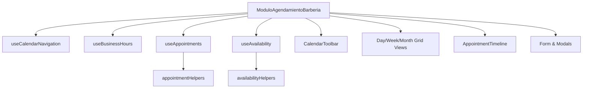

# Guía de Integración Técnica: Módulo Agendamiento Barbería

Este documento sirve como manual de referencia oficial del ecosistema **PROTOTIPE** para la integración y personalización del **Módulo de Agendamiento de Citas para Barberías**.

---

## 1. Arquitectura y Flujos de Datos

El módulo está estructurado bajo un patrón de contenedores desacoplados y auto-contenidos, minimizando el acoplamiento y permitiendo la reutilización.



### Flujo de Disponibilidad:
1. Al seleccionar una fecha y un barbero, `useAvailability` lee la jornada laboral configurada (`useBusinessHours`) para ese día de la semana.
2. Si el día está inactivo (cerrado), se devuelve disponibilidad vacía.
3. Si está abierto, se generan intervalos de 30 minutos desde la hora de inicio hasta la hora de cierre.
4. Para cada slot, se evalúa si colisiona con el almuerzo/descanso o con citas activas existentes del barbero (`checkTimeCollision` de `availabilityHelpers`).
5. Se muestra la rejilla de slots interactiva filtrando solo las horas hábiles.

---

## 2. API y Propiedades (Props)

### `<ModuloAgendamientoBarberia />`
Es el componente maestro integrador.
- **Props:**
  - `initialDate` (Date): Fecha de arranque inicial. (Por defecto: `new Date()`).
  - `initialView` (string): Tipo de vista por defecto (`'dia' | 'semana' | 'mes'`). (Por defecto: `'semana'`).

---

## 3. Ejemplo de Integración en React

Para montar el módulo de forma transparente en un Dashboard React:

```jsx
import React from 'react';
import ModuloAgendamientoBarberia from './components/barberia/ModuloAgendamientoBarberia';

export default function AppointmentDashboard() {
  return (
    <div className="min-h-screen bg-[var(--color-bg)] p-6">
      <div className="max-w-7xl mx-auto space-y-4">
        <header className="space-y-1">
          <h1 className="text-xl font-bold text-zinc-100">Panel de Control de Reservas</h1>
          <p className="text-xs text-zinc-500">Gestión de turnos, barberos y horarios en tiempo real.</p>
        </header>
        
        <main className="p-6 rounded-3xl bg-[var(--color-surface)] border border-[var(--color-border)]">
          <ModuloAgendamientoBarberia />
        </main>
      </div>
    </div>
  );
}
```

---

## 4. Estrategia de Personalización (White Label)

Toda la hoja de diseño visual consume variables CSS inyectadas en `:root`. Para cambiar el color de marca (por ejemplo, a un tema dorado barbería o fucsia moderno):

```css
:root {
  /* Marca dorada barbería */
  --primary-h: 43;
  --primary-s: 96%;
  --primary-l: 56%;
  
  /* Superficies */
  --color-background: #090a0f;
  --color-surface: #11131a;
  --color-surface-2: #191c26;
}
```

---

## 5. Buenas Prácticas y Rendimiento
- **Persistencia Local:** Los datos de citas y horarios se sincronizan automáticamente con `localStorage` bajo namespaces aislados para evitar cruce de datos.
- **Renderizado Eficiente:** Las listas pesadas y cálculos de disponibilidad se memorizan mediante `useMemo` para evitar recalcular cuadrículas mensuales al escribir en la barra de búsqueda de filtros.
- **Validación Semántica:** El formulario no permite agendar turnos si no se completan los campos mínimos obligatorios, protegiendo la integridad de la bitácora de citas.
