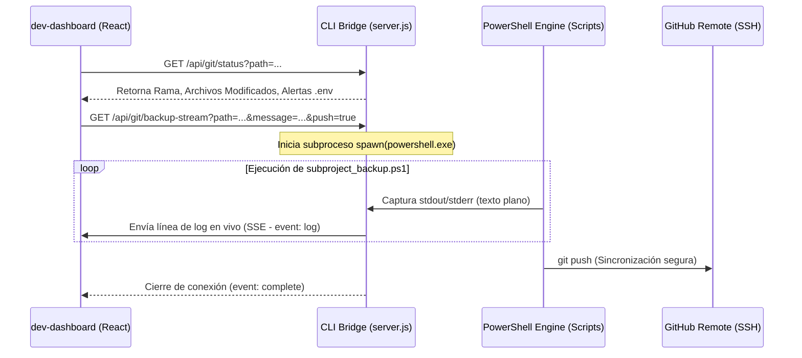

# 🛡️ Propuesta Técnica: Módulo Visual de Commits y Despliegues en Dashboard (Git & Backups)

Esta propuesta técnica detalla el diseño, la arquitectura y la implementación para incorporar una nueva sección de **"Commits & Despliegues"** dentro de la consola central de control (**dev-dashboard**). El objetivo es centralizar la gestión de control de versiones y copias de seguridad de todo el ecosistema (Consola, Cores e Instancias de Clientes) directamente en la interfaz web, consumiendo y potenciando el motor de scripts de PowerShell (`git_backup.ps1` y `subproject_backup.ps1`) existente en la raíz de `D:\PROTOTIPE\`.

---

## 🏗️ Arquitectura de Integración (Full-Stack)

Para lograr un sistema seguro, fluido y sin bloquear el hilo principal de Node.js, utilizaremos la misma arquitectura de **Server-Sent Events (SSE)** implementada exitosamente en la terminal de despliegue.



---

## 🎨 Especificación Visual de Interfaz (UI/UX)

La sección se estructurará en un layout de **dos columnas principales y una terminal inferior**, respetando el diseño atómico HSL de PROTOTIPE.

### 1. Panel Izquierdo: Selector de Objetivos (Ecosystem Navigator)
* **Lista Dinámica:** Un menú vertical que agrupa las carpetas del disco detectadas por el CLI:
  * **Respaldo Maestro:** Todo el ecosistema unificado (`D:\PROTOTIPE`).
  * **Consola Central:** El propio `dev-dashboard`.
  * **Plantillas Core:** Listado interactivo de moldes (Ventas, Agendamiento, Gastronomía, Servicios, Core-Seed).
  * **Instancias de Clientes:** Listado de proyectos activos en producción o dev.
* **Badges de Estado:** Cada elemento muestra su rama activa (`develop`, `main`) y un indicador de si tiene cambios pendientes de confirmación.

### 2. Panel Derecho: Formulario de Operaciones de Confirmación
* **Visor de Estado de Git (Short Status):** Muestra el listado de archivos modificados, añadidos o eliminados usando iconos semánticos (verde para creados, amarillo para modificados, rojo para eliminados).
* **Tarjeta de Alerta de Seguridad (Anti-Fugas):** Si se detecta un archivo `.env` sin ignorar en la lista, deshabilita los botones de commit y muestra una advertencia crítica en rojo neón con la recomendación de agregarlo al `.gitignore`.
* **Caja de Mensaje de Commit:**
  * Input de texto para ingresar el mensaje.
  * Botón **"Auto-generar Mensaje"**: Analiza los archivos de la lista de estado y propone un mensaje contextual (ej: `Auto-Snapshot [develop]: Mod: App.jsx, index.css | Add: E2EPanel.jsx`).
* **Switches de Control (Git Strategies):**
  * **Solo Respaldo Local (Commit local):** Para resguardar el código localmente si se está offline.
  * **Sincronizar a GitHub (Push):** Valida la conexión SSH remota antes de subir.
  * **Auto-Merge a Producción:** Si el usuario está en una rama de desarrollo (ej. `develop`), expone un interruptor para realizar la fusión automática a `main`/`master` (llamando a la lógica de fusiones seguras del script de PowerShell).

### 3. Panel Inferior: Terminal de Logs en Vivo (Console Stream)
* Ventana estilo consola oscura de Linux con barra superior, botones de control (Vaciar logs, Cancelar proceso) y el stream de la terminal.
* Muestra de forma progresiva la salida del comando PowerShell:
  * `~/git-backup $ [1/3] Indexando cambios locales...`
  * `~/git-backup $ [2/3] Creando commit local...`
  * `~/git-backup $ [3/3] Sincronizando con GitHub (Push)...`

---

## 🔌 Especificación de Endpoints del CLI Bridge (REST & SSE)

Agregaremos estos endpoints robustos en `D:\PROTOTIPE\Prototipe-CLI\server.js`:

### 1. `GET /api/git/targets`
* **Propósito:** Auto-detectar los subproyectos en el disco.
* **Lógica:** Escanea los directorios `D:\PROTOTIPE\Plantillas Core` y `D:\PROTOTIPE\Instancias Clientes` y lee si tienen carpeta `.git`.
* **Respuesta:**
  ```json
  {
    "master": { "name": "PROTOTIPE Ecosistema", "path": "D:\\PROTOTIPE", "branch": "main" },
    "cores": [
      { "name": "App Ventas", "path": "D:\\PROTOTIPE\\Plantillas Core\\App Ventas", "branch": "develop", "hasChanges": true }
    ],
    "instances": [
      { "name": "cliente-podologia", "path": "D:\\PROTOTIPE\\Instancias Clientes\\cliente-podologia", "branch": "main", "hasChanges": false }
    ]
  }
  ```

### 2. `GET /api/git/status`
* **Parámetros:** `path` (ruta absoluta del subproyecto).
* **Lógica:** Realiza validación de ruta (evitando Path Traversal) y ejecuta `git status --short` y `git rev-parse --abbrev-ref HEAD`.
* **Respuesta:**
  ```json
  {
    "branch": "develop",
    "changes": [
      { "file": "src/App.jsx", "type": "M" },
      { "file": "src/components/admin/E2EPanel.jsx", "type": "A" }
    ],
    "envLeak": false
  }
  ```

### 3. `GET /api/git/backup-stream` (SSE Endpoint)
* **Parámetros:** `path`, `message`, `push` (true/false), `merge` (true/false).
* **Lógica:** 
  1. Configura cabeceras SSE (`text/event-stream`, `no-cache`, `keep-alive`).
  2. Ejecuta un proceso hijo mediante `spawn` de Node.js llamando a `powershell.exe` pasándole el script y argumentos:
     ```javascript
     const ps = spawn('powershell.exe', [
       '-NoProfile', '-ExecutionPolicy', 'Bypass',
       '-File', 'D:\\PROTOTIPE\\subproject_backup.ps1',
       '-SubprojectPath', path,
       '-CommitMessage', message
     ]);
     ```
  3. Escucha los eventos `stdout.on('data')` y `stderr.on('data')` y los retransmite mediante `res.write('event: log\ndata: ...\n\n')`.
  4. Escucha el cierre del proceso (`close`) y envía el evento `event: complete` antes de cerrar la respuesta HTTP.

---

## 🚀 Plan de Escalabilidad y Multi-Tenant

Para que esta herramienta sea útil para todos los clientes y no colisione con el desarrollo futuro:
1. **Ignorado Selectivo de Credenciales:** El validador del CLI y de PowerShell analizará proactivamente que nunca se suban credenciales de Firebase de clientes específicos al repositorio del Core o del CLI.
2. **Historial de Despliegues Centralizado:** Al completar un backup exitoso de una instancia de cliente, el CLI Bridge guardará automáticamente un registro en la colección centralizada `clientes_control/{clientId}/historial_despliegues` en Firestore. Esto le dará al desarrollador visibilidad histórica de cuándo y con qué mensaje se actualizó el código de cada cliente específico de forma remota.
3. **Resguardo de Conexión:** Si la conexión a GitHub falla por tokens caídos o SSH, el sistema permite descargar un "Zip de Respaldo Físico" directamente desde la interfaz, garantizando que el desarrollador nunca pierda los cambios locales del cliente.

---

## 📈 Tareas para Ejecución Futura

Si decides aprobar esta propuesta, la ruta de implementación será:
* **Fase 1 (CLI Bridge):** Desarrollar la API en `server.js` para detección de carpetas, estatus de Git y el stream SSE de PowerShell.
* **Fase 2 (Frontend React):** Crear la página `Despliegues` y el componente de la Consola Git con el selector de subproyectos y la terminal de logs en vivo.
* **Fase 3 (Trazabilidad Firestore):** Conectar el registro de éxitos con la base de datos de telemetría e historial en caliente.
