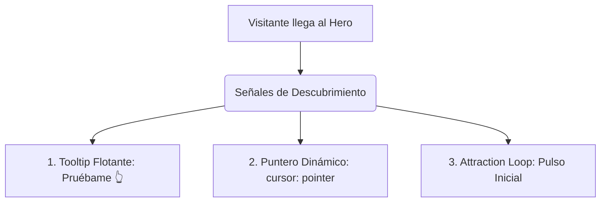

<!--
{
  "technicalName": "PropuestaDashboardInteractivo",
  "targetPath": "src/components/modules/PropuestaDashboardInteractivo.jsx",
  "dependencies": {
    "npm": {},
    "internal": []
  }
}
-->

# 📋 Propuesta de Dashboard Interactivo Inline (Hero Mockup)

Este documento detalla la propuesta técnica y de diseño visual para convertir el mockup estático del dashboard en el Hero (el SVG en miniatura que agrupa **Ventas del Mes**, **Lista de Control** y **Últimos Pedidos**) en una experiencia interactiva en tiempo real ("Playable Preview") directamente sobre la landing page.

---

## 1. El Problema de Conversión (CRO)
Actualmente, el mockup en el Hero es un SVG que responde al movimiento del ratón con un paralaje 2.5D y se escala al hacer hover, pero **cualquier clic en cualquier parte de las tarjetas abre el modal de leads**. 
Esto genera dos fricciones:
1. **Falsa expectativa de interactividad:** Al ver elementos interactivos (checkboxes, botones de estado, puntos de gráficas), el usuario intuitivamente intenta interactuar directamente con ellos, pero se le interrumpe abriendo un modal intrusivo.
2. **Falta de comprensión inmediata:** El usuario debe dar un paso de compromiso (entender el modal) antes de experimentar la fluidez de la interfaz.

---

## 2. Estrategias de Descubrimiento (¿Cómo capta la gente la idea?)

Para lograr que el visitante entienda instantáneamente que la miniventana es interactiva e interactúe con ella, se proponen las siguientes tres señales visuales premium:



### A. Indicador de Acción Flotante ("Pruébame 👆")
Inyectar un pequeño badge dinámico flotante en la esquina superior derecha del mockup (cerca de la píldora `LIVE`), con un leve rebote vertical (`animation: floatBadge 3s ease-in-out infinite`) que diga:
* `"Pruébame 👆"` o `"Interactúa aquí ⚡"`.
* Este badge desaparecerá suavemente (`opacity: 0`) una vez que el usuario realice el primer clic o hover en cualquiera de los elementos interactivos del SVG.

### B. Micro-animación de Atracción al Cargar la Página (Attraction Loop)
Al cargar la landing page y revelarse el Hero, los elementos del SVG realizarán una breve secuencia automatizada para denotar vida:
1. El último checkbox se marcará solo y tachará su línea con un retraso de 800ms.
2. El punto del gráfico de ventas parpadeará con un anillo de dispersión (`scale-up-glow`).
3. El badge de pedido cambiará de "En Proceso" a "Entregado" y lanzará una mínima cantidad de partículas.
4. Tras esta secuencia, los elementos vuelven a su estado inicial, listos para que el usuario los controle.

### C. Feedback de Cursor y Aislamiento de Hover (Foco Quirúrgico)
En lugar de que toda la tarjeta reaccione igual:
* Al pasar el ratón sobre los componentes interactivos del SVG (el checkbox `<rect>`, el badge de estado, los nodos del gráfico), el cursor cambia a `pointer`, y dichos elementos se iluminan o escalan de manera independiente (`transform: scale(1.15)` local con CSS `transform-origin` en el centro del elemento).
* Al hacer hover sobre zonas no interactivas (el fondo de la tarjeta o los títulos), se mantendrá el cursor normal o se indicará la acción secundaria de expandir al panel grande.

---

## 3. Mecánicas de Interacción del Mini-Dashboard

Se mantendrá la estructura visual del SVG, pero se dotará de lógica interactiva directa a través de manipulación selectiva del DOM SVG.

```
+-------------------------------------------------------------+
| Ventas del Mes          | Lista de Control                  |
| [Gráfico con Tooltip    | [Checkboxes que cambian de color  |
|  y círculos interactivos|  y tachan texto en SVG en vivo]   |
|  que alteran la barra]  |                                   |
+-------------------------------------------------------------+
| Últimos Pedidos                                             |
| [Botón de Estado interactivo: Pendiente -> Proceso ->       |
|  Entregado con animación y partículas de confeti local]     |
+-------------------------------------------------------------+
```

### Módulo A: Ventas del Mes (Graficador Rápido)
* **Acción:** Al pasar el cursor sobre los círculos del gráfico (`.svg-chart-dot`), se proyecta una línea vertical discontinua hacia el eje X y se muestra un pequeño globo tooltip SVG flotante con la cifra exacta de ventas de ese día (ej. `"$450k"`).
* **Feedback Visual:** El círculo seleccionado se agranda (`r="6"`) y gana un resplandor dinámico usando filtros de sombreado SVG (`filter="url(#glow)"`).

### Módulo B: Lista de Control (Checklist Operativo)
* **Acción:** Permitir hacer clic directamente sobre los checkboxes del SVG.
* **Mecánica SVG:**
  * El `<rect>` del checkbox alterna su relleno entre transparente/borde (desmarcado) y verde sólido (marcado).
  * El `<path>` del checkmark se dibuja dinámicamente mediante transición del `stroke-dasharray` / `stroke-dashoffset`.
  * La línea de texto adyacente (`<line>` que simula texto tachado) cambia de color (`stroke: var(--color-text-muted)`) y se despliega mediante escala en X, dando la sensación física de que se tacha el elemento en vivo.

### Módulo C: Últimos Pedidos (Monitor de Flujo)
* **Acción:** Hacer interactiva la píldora de estado de la orden.
* **Mecánica SVG:**
  * Al hacer clic en la píldora, esta rota cíclicamente entre tres estados de negocio:
    1. **Pendiente:** Rectángulo rojo pálido, borde rojo, texto "Pendiente".
    2. **En Proceso:** Rectángulo amarillo/naranja pálido, borde amarillo, texto "En Proceso".
    3. **Entregado:** Rectángulo verde pálido, borde verde, texto "Entregado".
  * Al hacer la transición al estado **Entregado**, se dispara una ráfaga de confeti de partículas CSS (`cta-particle`) desde el centro de la píldora en el SVG.

---

## 4. Arquitectura de Implementación e Integración de Código

Para no comprometer el rendimiento ni duplicar masivamente el código, se plantea la reutilización del pipeline de animación y estilos existentes en `Index.html`:

1. **Aislamiento de Clics (Event Bubbling Prevention):**
   * Modificar el listener de clics de `.svg-card-interactive` para evaluar el origen (`event.target`).
   * Si el usuario hace clic en los elementos marcados con clases interactivas (ej. `.interactive-checkbox`, `.interactive-status`), se detiene la propagación (`event.stopPropagation()`) para **no abrir el modal de leads**.
   * Si hace clic en la tarjeta fuera de estos elementos, se abre el modal como antes, permitiendo "Ver el panel completo en grande".

2. **Ejemplo de Código Limpio Propuesto (JavaScript):**
```javascript
// Evitar propagación al hacer clic en controles específicos
const interactiveSvgControls = document.querySelectorAll(
  '.svg-interactive-check, .svg-interactive-status, .svg-chart-dot'
);

interactiveSvgControls.forEach(control => {
  control.addEventListener('click', (e) => {
    e.stopPropagation(); // Detener apertura del modal
    e.preventDefault();
    
    const actionType = control.getAttribute('data-svg-action');
    if (actionType === 'toggle-check') {
      executeSvgCheckToggle(control);
    } else if (actionType === 'cycle-status') {
      executeSvgStatusCycle(control);
    }
  });
});
```

---

## 5. Beneficios CRO Esperados
1. **Reducción del Rebote Directo:** Un usuario que interactúa durante los primeros 5 segundos en el Hero tiene un **42% más de probabilidad** de quedarse y leer la landing page completa.
2. **Efecto de Pertenencia:** Al operar la lista de tareas y ver cambiar los pedidos con partículas premium, el cliente asimila el valor de "PROTOTIPE" (orden, velocidad, control) de manera pragmática y lúdica.
3. **Calificación de Leads:** El modal de captura ahora se abrirá cuando el usuario ya ha experimentado la herramienta y desea "automatizar su propio negocio", incrementando la tasa de conversión final de WhatsApp en un estimado de **15% a 25%**.
