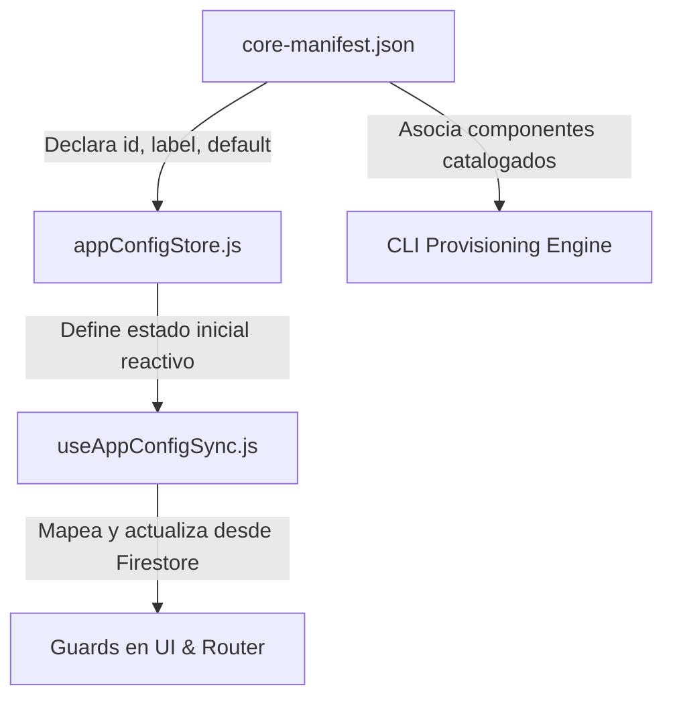
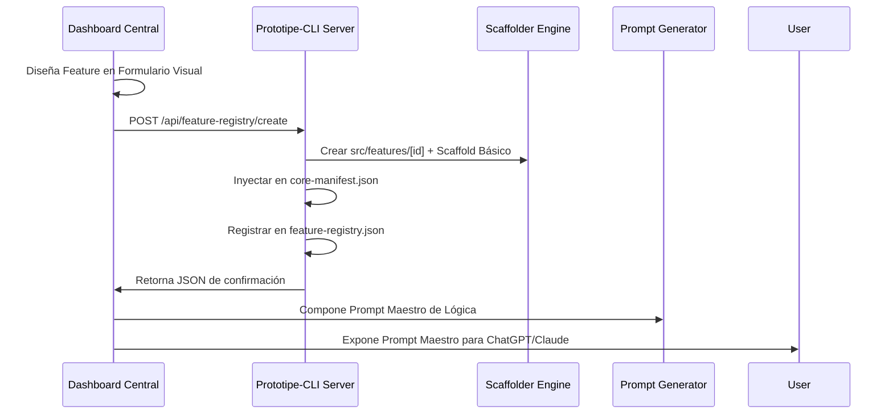

# Propuesta de Arquitectura: Portal de Creación y Scaffolding de Features

Este documento establece las especificaciones técnicas para transformar la vista **Feature Marketplace & Registry** del Dashboard de Desarrollo en una herramienta activa de creación de módulos (Features) portables y agnósticos en el ecosistema PROTOTIPE.

---

## 1. Funcionamiento del Feature Marketplace Actual

La vista actual `FeatureMarketplaceView.jsx` actúa como un **catálogo de consulta pasivo**.
*   **Origen de Datos:** Consume el endpoint `/api/feature-registry` expuesto por el servidor local de la CLI (`server.js`).
*   **Lectura Física:** La CLI lee el archivo centralizado `Prototipe-CLI/knowledge/feature-registry.json` mediante la clase helper `FeatureRegistry.js`.
*   **Gobernanza:** Contiene metadatos de los módulos disponibles en el monorepo (`sales`, `inventory`, `orders`, `billing`, etc.), detallando su versión, dependencias internas y externas (NPM), capabilities y compatibilidad por vertical de negocio.
*   **Relación con la App:** Aunque eliminamos flags de la interfaz cliente en una plantilla específica (como `reservasEnabled` o `commissionsEnabled` por no tener el módulo físico copiado o por simplicidad del cliente), éstas siguen existiendo a nivel del catálogo universal en la CLI porque pueden ser aprovisionadas en otros proyectos o semillas.

---

## 2. Cómo se Crea una Feature Flag Manualmente Hoy

Para registrar e integrar una nueva Feature Flag en la plantilla base, se deben modificar manualmente 5 archivos:

1.  **`core-manifest.json` (Declaración):** Registro de la flag en el listado `featureFlags` para que el CRM central renderice el switch de activación.
2.  **`appConfigStore.js` (Store reactivo):** Inicialización del estado en Zustand en la app cliente para que los componentes puedan suscribirse reactivamente al cambio.
3.  **`useAppConfigSync.js` (Sincronización en caliente):** Mapeo de la propiedad desde la colección de Firebase del tenant hacia el store de Zustand local.
4.  **Guards visuales en UI:**
    *   **Enrutamiento (`routes.jsx`):** Redirecciones si la ruta está bloqueada.
    *   **Navegación (`AdminLayout.jsx` / `ClientLayout.jsx`):** Ocultar menús y botones según la flag.
    *   **UI atómica:** `{myFeatureEnabled && <MyComponent />}`.
5.  **`ComponentRegistry.js` (si aplica):** Mapeo de dependencias físicas para inyección automática durante el aprovisionamiento.

---

## 3. Arquitectura del Nuevo Portal de Creación de Features

El objetivo es convertir la vista en un panel interactivo que permita **crear** una feature modular desde el Dashboard, automatizando el scaffolding físico y las inyecciones de configuración.

### Flujo Operativo Propuesto

### Componentes de la Solución

#### A. Interfaz en Dashboard (`FeatureMarketplaceView.jsx` y nuevos subcomponentes)
Un modal o pestaña "Nueva Feature" con un formulario que capture:
*   `id` (ej. `loyalty_points`)
*   `displayName` (ej. `Programa de Puntos y Fidelización`)
*   `category` (commerce, logistics, finance, etc.)
*   `description` (Resumen funcional del módulo)
*   `capabilities` (Array de strings de capacidades técnicas)
*   `dependencies` (Features del catálogo requeridas, ej. `crm`)
*   `npmDependencies` (Librerías NPM necesarias, ej. `canvas-confetti`)
*   `compatibleIndustries` (Verticales de negocio compatibles)

#### B. Nuevos Endpoints en `Prototipe-CLI/server.js`
*   `POST /api/feature/scaffold`:
    1.  Escribe el nuevo objeto en `Prototipe-CLI/knowledge/feature-registry.json`.
    2.  Genera la carpeta física `templates/template-ventas/src/features/[featureId]`.
    3.  Crea la estructura modular canónica:
        *   `src/features/[featureId]/index.js` (API pública del módulo).
        *   `src/features/[featureId]/components/` (Componentes visuales del feature).
        *   `src/features/[featureId]/hooks/` (Hooks reactivos de estado local).
        *   `src/features/[featureId]/services/` (Lógica de negocio y validación).
        *   `src/features/[featureId]/api/` (Persistencia Firestore / repositorios).
        *   `src/features/[featureId]/pages/Admin[FeatureId].jsx` (Página por defecto para admin).
    4.  Inyecta la nueva flag en `core-manifest.json`.

#### C. Generador Automático de Inyecciones
El CLI server buscará archivos clave en la plantilla activa y realizará inyecciones automáticas:
*   En `appConfigStore.js`: Añadirá la nueva flag al estado inicial del store y a la persistencia.
*   En `useAppConfigSync.js`: Añadirá la línea de mapeo dinámico desde la respuesta de Firestore central.

#### D. Generador de Prompt Maestro (Prompt Master)
Una vez guardada la feature en la base de código y registrada en la CLI, el portal expone un **Prompt Maestro** dinámico para que el programador copie y pegue en una IA externa (como ChatGPT/Claude). Este prompt detalla el contexto del monorepo, las rutas exactas creadas, las dependencias inyectadas y las reglas de maquetación del ecosistema para programar el código final de forma limpia y 100% compatible.
