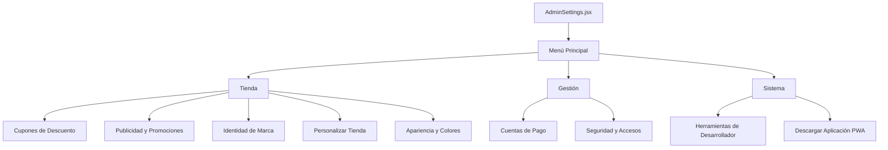

# 🛠️ Estructura Jerárquica y Ramificación de Ajustes (App Ventas)

Este documento detalla la arquitectura de las opciones de configuración configuradas en la interfaz de administración (`AdminSettings.jsx`), sirviendo de mapa técnico antes de su modularización física.

---

## 🗺️ Mapa General del Menú de Configuración

Las configuraciones se dividen visualmente en tres categorías principales en la pantalla de inicio del panel de control de administración (cuando `activeSection === null`):

---

## 📂 Detalle de Secciones y Ramificaciones Internas

### 1. 🎫 Cupones de Descuento (`activeSection === 'cupones'`)
*   **Listado de Cupones:** Tabla responsiva que muestra los códigos de descuento creados, su vigencia y estado. Incluye un contador en tiempo real de usos por cupón basado en los pedidos completados.
*   **Formulario de CRUD (Crear/Editar):**
    *   `code`: Código promocional único (Texto en mayúsculas, fuente mono espaciada).
    *   `type`: Tipo de descuento (`percentage` | `fixed`).
    *   `value`: Porcentaje (%) o valor fijo ($) del descuento.
    *   `minPurchase`: Monto mínimo de compra requerido para activar el cupón.
    *   `startDate` / `endDate`: Rango de fechas de vigencia configurables con `CustomDatePicker`.
    *   `active`: Estado de activación lógica del cupón (Interruptor).

### 📣 2. Publicidad y Promociones (`activeSection === 'publicidad'`)
*   **Listado de Campañas:** Permite activar o desactivar anuncios con un límite estricto de máximo 5 anuncios activos de forma simultánea.
*   **Formulario de CRUD (Crear/Editar) y Ramificación por Tipo:**
    *   `type`: Selector de tipo de anuncio:
        *   **Producto del Inventario:**
            *   `productId`: Selector dinámico de productos del inventario activo.
            *   `discountType` y `discountValue`: Aplica descuentos directos a la ficha del producto.
            *   `customTitle`: Título publicitario alternativo opcional.
            *   `customBanner`: URL de imagen de banner publicitario.
            *   `glowEffect`: Interruptor que inyecta un sombreado y brillo animado premium (efecto HSL) alrededor de la tarjeta.
        *   **Promoción Personalizada:**
            *   `isTemporalProduct`: Interruptor que habilita la venta de combos o productos que no pertenecen al inventario (con precio original y precio promocional).
            *   `title`, `category`, `description`: Metadatos del anuncio.
            *   `image` / `banner`: URLs de imágenes cuadrada y horizontal.
            *   `colors`: Paleta visual del anuncio (Degradados predefinidos o color sólido de fondo mediante selector HSL, y color del texto).
            *   `ctaText`: Texto del botón de llamado a la acción.
            *   `ctaAction`: Comportamiento de clic (`modal` | `whatsapp` | `url` | `category`).
            *   `ctaValue`: Valor asociado a la acción (Número de WhatsApp, Enlace URL, ID de categoría o texto explicativo largo del modal).
    *   `startDate` / `endDate`: Rango de fechas de vigencia.

### 🏢 3. Identidad de Marca (`activeSection === 'marca'`)
*   **Ajustes de Tienda:** Nombre del Negocio (`appName`), Nombre del Vendedor (`sellerName`), WhatsApp de pedidos (`whatsappAdmin` sin prefijo `+`).
*   **Apariencia de Acceso:** URL del Logotipo (`appIcon`), Mensaje de Confianza en Login (`loginTrustMessage`) y Eslogan de la tienda (`slogan`).
*   **Efectos Visuales:** `welcomeWavesEnabled` (efecto de ondas animadas detrás del logo en pantallas de carga/bienvenida).
*   **Configuración PWA (Instalación Móvil):**
    *   `pwaUseBrandIcon`: Interruptor para usar el logotipo sobre el color principal de la marca como icono del celular de forma automática.
    *   `pwaAppName`: Nombre de la aplicación de inicio.
    *   `pwaAppIcon`: URL del icono de instalación independiente (si `!pwaUseBrandIcon`).

### ⚙️ 4. Personalizar Tienda (`activeSection === 'personalizar'`)
Se ramifica en un menú secundario de subsecciones (`activeSubSection`):

1.  **Perfiles de Empleados (`empleados`):**
    *   `hasMultipleEmployees`: Interruptor global del módulo.
    *   **CRUD de Empleado:** Nombre Completo, WhatsApp Móvil, Rol Operativo (Vendedor, Repartidor, etc. que corresponden a accesos Firebase Portals), PIN Táctil de Seguridad (6 dígitos numéricos), Salario Fijo, Frecuencia de Pago (`mensual` | `quincenal` | `semanal`), Próxima fecha de pago (`CustomDatePicker`) y Observaciones.
    *   **Lobby y QR de Acceso:** Generador de Códigos QR para el login directo de empleados sin usar la web pública (PNG, Imprimir, Copiar Link).
2.  **Métodos de Entrega (`entregas`):**
    *   `pickup.enabled`: Retiro en local. Habilita mapa interactivo (`LeafletMapPicker`), dirección de retiro e instrucciones.
    *   `shipping.enabled`: Envíos a domicilio (activado/desactivado).
    *   `digital.enabled`: Servicios/Entrega digital. Habilita instrucciones.
    *   *Mensajero Propio:* Integración del panel comisional de mensajeros (`DeliveryCustomMessengerPanel`).
3.  **Ventas al por Mayor (`mayorista`):**
    *   `wholesaleSettings.enabled`: Interruptor general para habilitar la visualización y barra de cotización mayorista en el catálogo del cliente.
4.  **Eventos de Temporada (`temporada`):**
    *   `activeSeasonalEvent`: Configura decoraciones visuales de fondo y paletas HSL festivas (`navidad`, `halloween`, `madre`, `padre`, `nino`, `amistad`, `verano`, `semanasanta`, `mascota`).
5.  **Garantías y Reclamos (`garantias`):**
    *   `claimsEnabled`: Habilita a los clientes iniciar reclamos o solicitar cambios sobre sus pedidos en estado de completados.
6.  **Seguimiento de Pedidos (`seguimiento`):**
    *   `orderTrackingEnabled`: Habilita el portal de tracking público de pedidos sin requerir login.
    *   `trackingWaTemplate`: Textarea con inserción rápida de chips dinámicos (`{cliente}`, `{pedido}`, `{estado}`, `{total}`, `{enlace}`, `{tienda}`).
    *   `appPromo.enabled`: Habilita banner promocional de instalación PWA en el portal del cliente (Título, Imagen URL, Mensaje comercial).
7.  **Módulos Activos (`modulos`):**
    *   Interruptores globales de control de módulos: Crédito, Cupones, Garantías y Ventas al por Mayor.
8.  **Facturación Electrónica DIAN (`dian`):**
    *   `dianSettings.enabled`: Habilita recopilación de datos tributarios en Colombia.
    *   Campos: Razón Social, NIT, Dígito de Verificación (DV), Correo Fiscal e IVA base (%).
9.  **Auditoría de Stock (`movimientos`):**
    *   Listado histórico de auditoría de entradas y salidas de almacén, filtros por rol (Admin/Empleado) y por responsable del ajuste.

### 🎨 5. Apariencia y Colores (`activeSection === 'apariencia'`)
*   `isDarkMode`: Alternador de Modo Claro / Modo Oscuro.
*   `animationsEnabled`: Interruptor para activar transiciones y gestos elásticos (Framer Motion).
*   `guidedModeEnabled`: Interruptor para el sistema de Compra Guiada (asistente virtual para el cliente).
*   `theme`: Selector de tema principal (paletas avanzadas HSL).
*   `actionColor`: Selector de color exacto para los botones de compra (carrito/pago).
*   `appFont`: Selector de tipografía de Google Fonts agrupadas por estilo (Modernas, Clásicas, Elegantes).
*   `appRadius`: Estilo de redondez de tarjetas y inputs (`squared` | `rounded` | `pill`).
*   `catalogLayout`: Diseño de cuadrícula del cliente (`list` | `grid2`).

### 💳 6. Cuentas de Pago (`activeSection === 'ventas'`)
*   Mapeo de datos bancarios para recibir transferencias en los pedidos del cliente (Nombre del banco, tipo de cuenta, número, nombre del titular y documento).

### 🔒 7. Seguridad y Accesos (`activeSection === 'seguridad'`)
*   Formulario de cambio de credenciales de administrador (Contraseña actual obligatoria, nuevo correo y nueva contraseña).

### 🛠️ 8. Herramientas de Desarrollador (`activeSection === 'developer'`)
*   **Filtros del Catálogo (`dev-filtros`):** Habilita los filtros generales de categorías, tallas y colores, y la creación dinámica de atributos personalizados (Sabor, Marca, Material, etc.).
*   **Optimización Comercial (`dev-opt-comercial`):**
    *   *Etiquetas Inteligentes:* Habilita y parametriza el texto, color de fondo, color de texto y estilo de las etiquetas de conversión (`Más Vendido`, `Oferta Imperdible`, `Última Unidad`, `Nuevo`).
    *   *Galería de imágenes avanzada, variaciones visuales, indicadores de variación y recomendados en carrito.*
*   **Facturación Centralizada (`dev-facturacion`):** Consolidación de comisiones de desarrollo, método comisional y firma con exportación de PDF de conformidad.
*   **Restauración de Aplicación (`dev-restauracion`):** Borrado real y físico a cero de la base de datos de Firebase escribiendo "RESTAURAR".
*   **Contacto Desarrollador (`dev-contacto`):** WhatsApp del programador del ecosistema.
*   **Reportar Error (`dev-reporte-error`):** Gatillador manual de telemetría de fallos.

---

## 📈 Lógica de Estado y Persistencia

Todas las configuraciones se administran en tiempo real mediante:
1.  **Zustand Store (`useAppConfigStore.js`):** Gestiona el estado reactivo global en el frontend de la aplicación.
2.  **Firebase Firestore (`appConfigService.js`):** Sincroniza y guarda los cambios de forma persistente en la colección `/config/` de la base de datos, impactando de forma instantánea la visualización de la tienda del cliente.
