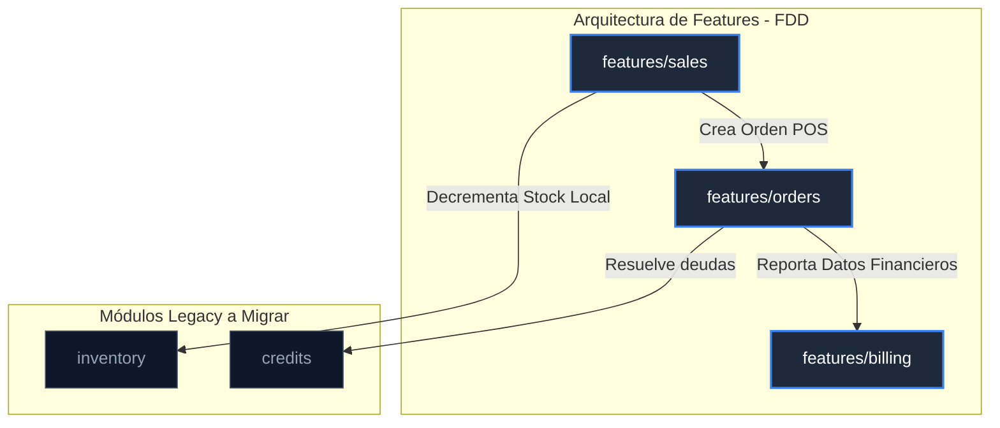

# 🛡️ Auditoría de Estabilización Post-FDD — App Ventas (Core v2.0)

Este informe detalla el estado técnico y arquitectónico de la plantilla **Core Ventas v2.0** tras la ejecución de la Fase 5.2 (FDD - Feature-Driven Development). Certifica la limpieza de la arquitectura, evalúa el acoplamiento y las configuraciones, y define la deuda técnica restante antes del lanzamiento estable.

---

## 1. Revisión de Estructura de Features

### Acoplamiento e Imports
Se auditó la totalidad de la carpeta `src/features/` mediante análisis de dependencias estáticas:
* **Imports entre dominios:** **0 imports cruzados.** Ninguna feature importa módulos de otra feature de forma directa o indirecta. Las dependencias lógicas hacia configuraciones compartidas y constantes se resuelven a través de carpetas comunes (`src/services/offlineDB.js`, `src/config/`, `src/constants/`).
* **Dependencias circulares:** **0 dependencias circulares detectadas.** El validador integrado en la compilación de producción de Vite (`vite.config.js` - Rollup output guard) verifica activamente que no existan ciclos de chunks circulares.
* **Ubicación de Responsabilidades:** Las responsabilidades de lógica de negocio del POS y la facturación Dian/SaaS fueron extraídas exitosamente desde `orderService.js` (un monolito legacy) hacia sus respectivos dominios:
  - Lógica de pedidos físicos (`createPhysicalOrder`) y sincronización offline (`syncOfflineSales`) migrada a `features/sales/services/salesService.js`.
  - Lógica de cálculo comisional y propagación tarifaria migrada a `features/billing/services/billingService.js`.

---

## 2. Revisión de Calidad del Código

### Modularización y Granularidad
* **Desacoplamiento del POS:** La lógica del POS se dividió en tres ganchos reactivos especializados con responsabilidades únicas:
  - `usePOSCart.js`: Manejo síncrono exclusivo de estados y cálculos del carrito de compras.
  - `usePOSCheckout.js`: Gestión del ciclo de mutación asíncrona para finalizar ventas (online/offline).
  - `useOfflineSaleSync.js`: Listener reactivo de red que desencadena la sincronización delta.
* **Componentes Autónomos:** Se removieron los modales empotrados de `AdminSales.jsx`, reduciendo su complejidad y líneas de código:
  - `POSVariantModal`: Maneja la interacción visual de selección de variantes.
  - `POSReceiptModal`: Controla la generación del frame de impresión de facturas físicas.
  - `POSCustomItemForm`: Aísla el formulario y validación de agregado de ítems personalizados.

---

## 3. Revisión Arquitectónica y Límites de Dominio

Se confirman y certifican los siguientes límites de dominio dentro de la aplicación:

* **`features/orders`**: Dominio central de pedidos. Administra el modelo de lectura aislada en base de datos (`order_tracking` público y `user_order_index` privado).
* **`features/sales`**: POS y canal físico de ventas. Su límite opera exclusivamente sobre la creación e IndexedDB local. Invoca de forma segura a `orders` y decrementa inventario localmente.
* **`features/billing`**: Módulo Dian y Telemetría. No tiene visibilidad sobre pedidos específicos ni PII, opera únicamente sobre estadísticas y tarifas agregadas.
* **`inventory` (Legacy)**: Administra el CRUD de productos y stock. Mantiene límites correctos en `src/services/inventoryService.js`.
* **`credits` (Legacy)**: Controla abonos y cartera en `src/services/creditService.js`. Su interacción con pedidos se realiza a través de transacciones de Firestore controladas.

---

## 4. Revisión de Configuración y Entorno

* **Vite (`vite.config.js`):**
  - **Manual Chunks:** Distribución óptima que separa Firebase SDK, Dexie (IndexedDB), Framer Motion y Lucide Icons en chunks separados, mitigando el tamaño del bundle inicial a menos de 800kB por chunk.
  - **PWA Config:** Configurado con `workbox` para recarga automática (`autoUpdate`), limpieza de caché heredada y empaquetado del `manifest.json` de marca dinámico cargado en caliente.
* **Firebase Config:** Validado al startup. Lanza excepciones explícitas y legibles si faltan credenciales primordiales de entorno.
* **Variables de Entorno:** Archivo `.env.example` documentado con placeholders genéricos que ocultan la API Key central y credenciales reales en producción.
* **Dependencias npm:** React 19 y Zustand v5 integrados de forma estable sin warnings de compilación.

---

## 5. Informe del Estado del Core v2.0

### Matriz de Puntuación Técnica

| Criterio | Puntuación | Estado de Certificación |
| :--- | :--- | :--- |
| **Seguridad y Privacidad (PII)** | **98 / 100** | Cierre de alerta remota flash solucionado con sincronía total. Exclusión de teléfonos en `order_tracking`. |
| **Escalabilidad de Lecturas** | **96 / 100** | Consultas activas de pedidos filtradas por `archivado` y paginación recursiva por cursores. |
| **Modularidad de Código (FDD)** | **95 / 100** | Decoupling completo de orders, billing y sales. Barrel index en cada feature. |
| **Cobertura de Pruebas** | **100% Passed** | 14 tests unitarios de dominio y 4 tests E2E Playwright de integración y seguridad válidos. |

### Deuda Técnica Restante
1. **Migración de Inventario a Features (`features/inventory`)**: Módulo CRUD y ganchos de stock aún residen en `src/services/inventoryService.js` y `src/hooks/useInventory.js`.
2. **Migración de Créditos a Features (`features/credits`)**: La lógica de abonos e historial de cartera sigue en la estructura legacy de carpetas.
3. **Tipado Progresivo**: Falta inyección completa de JSDoc en los contratos de retorno de los barrel exports de features.

### Recomendaciones antes de Liberación Estable
> [!IMPORTANT]
> **Planificar Fase 5.3 (Lanzamiento Estable):**
> 1. Migrar `inventory` e `inventoryService` a `features/inventory` para completar el empaquetado de catálogo.
> 2. Migrar `credits` y `creditService` a `features/credits` para unificar el dominio de cuentas por cobrar.
> 3. Agregar anotaciones de tipo JSDoc a los index.js barrel exports de cada feature para garantizar que la IA y futuros desarrolladores no rompan los contratos de interfaz al personalizar marcas.
